# Writing a Linux kernel driver for a custom HLS systolic matmul IP

*This is Part 5 of the Embedded Linux ([Zynq SoC](https://www.amd.com/en/products/adaptive-socs-and-fpgas/soc/zynq-7000.html)) series. Read [Part 1](https://rafae1130.github.io/posts/embedded_linux/embedded-linux-zynq-soc-part-1.html), [Part 2: Device Tree](https://rafae1130.github.io/posts/embedded_linux/embedded-linux-zynq-soc-part-2.html), [Part 3: Device Tree Overlay and UIO](https://rafae1130.github.io/posts/embedded_linux/embedded-linux-zynq-soc-part-3.html) and [Part 4: Writing a Linux Platform Driver](https://rafae1130.github.io/posts/embedded_linux/embedded-linux-zynq-soc-part-4.html) if you haven't already.*

## Introduction

This blog we'll be writing our own kernel driver for a custom IP.  the custom IP being used is a systolic array used for matrix multiplication in AI silicon like google TPUs. This one is created in HLS and not really optimized as the purpose of this blog is kernel driver not HLS (which will come in a later series). I won't give a whole driver from start and then explain. Rather we'll start with bare minimum and then add functionality one by one testing at each step.

The main functionality requried by this driver is to initiate data transfer through inbuilt dma in the ip. Perform matmul, return the results and generate an interrupt to the userspace application. But we’ll do this step by step:

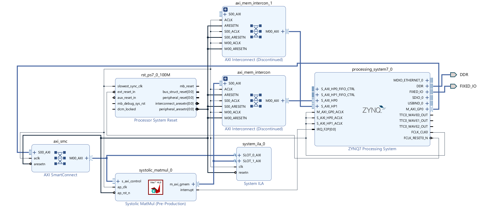

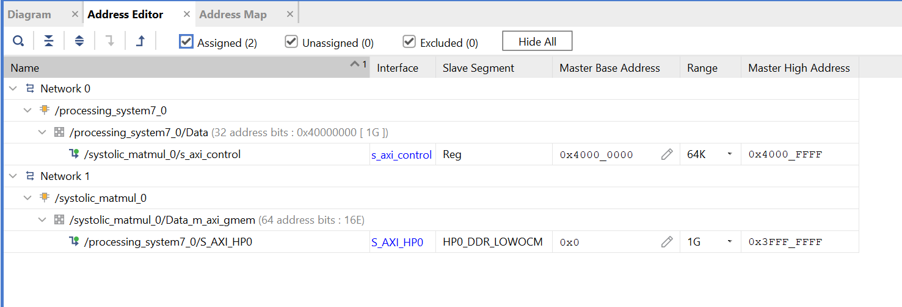

## Table of contents {#table-of-contents}

1. [How the IP works](#how-the-ip-works)
2. [Step 1 - module init and exit](#step-1-module-init-and-exit)
3. [Step 2 - probe, the device tree and a misc device](#step-2-probe-the-device-tree-and-a-misc-device)
   - [3.1 platform_driver struct](#platform_driver)
   - [3.2 platform_driver_register / unregister](#platform_driver_register)
   - [3.3 of_device_id](#of_device_id)
   - [3.4 systolic_dev](#systolic_dev)
   - [3.5 systolic_probe](#systolic_probe-s2)
   - [3.6 systolic_remove](#systolic_remove-s2)
   - [3.7 Device tree overlay](#device-tree-overlay-s2)
   - [3.8 Running it on the board](#running-it-on-the-board)
4. [Step 3 - IOCTL register read and write](#step-3-ioctl-register-read-and-write)
   - [4.1 IOCTL commands](#ioctl-commands)
   - [4.2 Register offsets](#register-offsets)
   - [4.3 systolic_open and systolic_release](#systolic_open_release)
   - [4.4 systolic_ioctl](#systolic_ioctl-s3)
   - [4.5 file_operations struct](#file_operations)
   - [4.6 The userspace application](#the-userspace-application-s3)
5. [Step 4 - DMA buffers and read/write](#step-4-dma-buffers-and-the-data-path)
   - [5.1 New headers](#new-headers)
   - [5.2 systolic_dev struct](#systolic_dev-struct)
   - [5.3 systolic_set_ptr](#systolic_set_ptr)
   - [5.4 systolic_alloc_buffers](#systolic_alloc_buffers)
   - [5.5 systolic_free_buffers](#systolic_free_buffers)
   - [5.6 systolic_write](#systolic_write-s4)
   - [5.7 systolic_read](#systolic_read-s4)
   - [5.8 systolic_ioctl](#systolic_ioctl-s4)
   - [5.9 systolic_probe](#systolic_probe-s4)
   - [5.10 file_operations](#file_operations_s4)
   - [5.11 systolic_remove](#systolic_remove-s4)
   - [5.12 Device tree update](#device-tree-update)
   - [5.13 Device tree overlay](#device-tree-overlay-s4)
   - [5.14 The userspace application](#the-userspace-application-s4)
6. [Step 5 - interrupts](#step-5-interrupts)
   - [6.1 New headers](#new-headers-s5)
   - [6.2 systolic_dev](#systolic_de)
   - [6.3 systolic_isr](#systolic_isrr)
   - [6.4 systolic_ioctl](#starting-the-ip-without-polling)
   - [6.5 systolic_read](#systolic_read-s5)
   - [6.6 systolic_write](#systolic_write-s5)
   - [6.7 systolic_probe](#systolic_probe-s5)
   - [6.8 The userspace application](#the-userspace-application-s5)
   - [6.9 Device tree overlay](#device-tree-overlay-s5)
7. [Summary](#summary)
8. [Glossary: the headers we included](#glossary)

## How the IP works {#how-the-ip-works}

The IP is a systolic matrix multiplier generated from HLS. It takes two n x n matrices, A and B, and writes the product into C. A and B hold 16 bit signed values, C holds 64 bit signed values so the accumulation has room and does not overflow.

Internally it works on fixed size tiles, so n has to be a multiple of the tile size. That is the only part of the tiling that matters for the driver, and it is why the driver rejects a size that does not fit.

The IP has two kinds of port, and the difference between them is the whole reason this driver looks the way it does:

- One AXI-full master to read matrix A and B and write back matric C. The driver does not interact to the IP through this interface. 

- One AXI-Lite slave port. This is the register space, its the only way the driver interact with out IP. 

| Offset | Name | What it is for |
| --- | --- | --- |
| `0x00` | AP_CTRL | control and status. Bit 0 starts the IP, bit 1 goes high when it has finished |
| `0x04` | GIE | global interrupt enable |
| `0x08` | IER | interrupt enable. Bit 0 is the done interrupt |
| `0x0c` | ISR | interrupt status. Write a 1 back to a bit to clear it |
| `0x10` | A | address of matrix A, low 32 bits. High half at `0x14` |
| `0x1c` | B | address of matrix B, low 32 bits. High half at `0x20` |
| `0x28` | C | address of matrix C, low 32 bits. High half at `0x2c` |
| `0x34` | N | the matrix size n |

The address registers are 64 bit, split across two 32 bit registers each.

So the sequence never changes. Write the three buffer addresses and n, set the start bit, and wait for done. We'll do that by polling first, and switch to the interrupt in the last step.

## Step 1 - module init and exit {#step-1-module-init-and-exit}

To start writing the driver, we first need to create a module template in petalinux. Inside your petalinux directory, run this command:

`petalinux-create modules --name <driver-name> --enable`

In our case it will be:

`petalinux-create modules --name systolic --enable`

This will create a folder in recipes-modules with build files and a c file in your petalinux project directory like this:

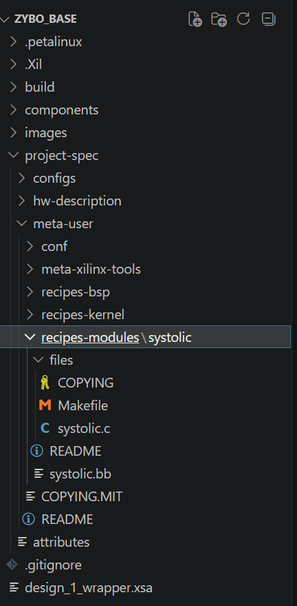

We'll write our code in systolic.c. You'll notice that this file already has some default template. its not recommended to use that as it uses older kernel APIs and is not updated for the current kernel used in current Petalinux versions and might cause problems.

We start by the bare minimum driver code: 


#include <linux/module.h>
#include <linux/init.h>
#include <linux/kernel.h>

static int systolic_init (void){
    printk("hello from systolic\r\n");
    return 0;
}

static void systolic_exit(void){
    printk("Goodbye from systolic\r\n");
}

module_init(systolic_init);
module_exit(systolic_exit);
MODULE_LICENSE("GPL");
MODULE_DESCRIPTION("Provide interface to systolic IP for fast matmul operation");
MODULE_AUTHOR("Rafae");


This is the simplest kernel driver. Right now the main thing its doing is creating init and exit function and telling kernel to register them as init and exit through moduleinit() and module_exit(). [`systolic_init()`](#s1-L5) will then be called whenever we load the driver through insmod command, and [`systolic_exit()`](#s1-L10) will be called whenever we remove the driver through rmmod command.
Declaring the license as GPL means its open source. Which is required to use most of the kernel APIs and features. And descriptions and author are just for module readibilty.

After writing our code in systolic.c we can build it like:

petalinux-build -c `<driver-name>`

The `<driver-name>` should be same as the one you used in petalinux-create command before. So:

petalinux-build -c systolic

This will build the module and will place it in tmp directory in build folder. To find the exact path, use this:

find build/ -name systolic.ko

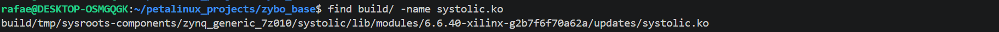

Copy this on board.

Load driver through insmod command

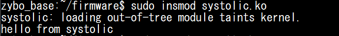

And remove through rmmod command:

You might notice that we didn't load any fpga bitstream and overlay. That is because the current driver is not talking to the hardware at all so there's no need for it. In next step we'll start talking to the hardware and thus will need both.

Next step is probing the device tree from driver and read the node properties.

## Step 2 - probe, the device tree and a misc device {#step-2-probe-the-device-tree-and-a-misc-device}

In this section we'll learn how to actually make the device tree and driver talk with each other and tell the kernel about our IPs existence. The complete code is shown below. The code changes added for this section are highlighted.


#include <linux/module.h>
#include <linux/init.h>
#include <linux/kernel.h>
#include <linux/of.h>
#include <linux/miscdevice.h>
#include <linux/platform_device.h>
#include <linux/fs.h>
#include <linux/io.h>

#define DRIVER_NAME "systolic"

struct systolic_dev {
    struct miscdevice miscdev;
    void __iomem     *base;
};

static const struct of_device_id systolic_of_match[] = {
    {
        .compatible = "rafae,systolic_driver-1.0",
    },
    {}
};

static const struct file_operations systolic_fops = {
    .owner = THIS_MODULE,
    //empty for now, will be explained later
};

static int systolic_probe(struct platform_device *pdev)
{
    struct systolic_dev *priv;
    int rc;

    priv = devm_kzalloc(&pdev->dev, sizeof(*priv), GFP_KERNEL);
    if (!priv)
        return -ENOMEM;

    priv->base = devm_platform_ioremap_resource(pdev, 0);
    if (IS_ERR(priv->base))
        return PTR_ERR(priv->base);

    priv->miscdev.minor  = MISC_DYNAMIC_MINOR;
    priv->miscdev.name   = "systolic0";
    priv->miscdev.fops   = &systolic_fops;

    rc = misc_register(&priv->miscdev);
    if (rc)
        return rc;

    platform_set_drvdata(pdev, priv);
    dev_info(&pdev->dev, "/dev/%s is ready at base_address = 0x%08x\n", priv->miscdev.name, priv->base);
    return 0;
}

static int systolic_remove(struct platform_device *pdev)
{
    struct systolic_dev *priv = platform_get_drvdata(pdev);

    misc_deregister(&priv->miscdev);
    dev_info(&pdev->dev, "removed\n");
    return 0;
}

static struct platform_driver systolic_driver = {
        .probe = systolic_probe,
        .remove = systolic_remove,
        .driver = {
            .name = DRIVER_NAME,
            .of_match_table = systolic_of_match,
    },
};

static int systolic_init (void){
    printk("hello from systolic\r\n");
    return platform_driver_register(&systolic_driver);
}

static void systolic_exit(void){
    printk("Goodbye from systolic\r\n");
    platform_driver_unregister(&systolic_driver);
}

module_init(systolic_init);
module_exit(systolic_exit);
MODULE_LICENSE("GPL");
MODULE_DESCRIPTION("Provide interface to systolic IP for fast matmul operation");
MODULE_AUTHOR("Rafae");


### platform_driver struct {#platform_driver}

Lets start with our first struct. Now, as we want our driver to discover the our IP's device tree node and read its properties, we need to create a struct of [`platform_driver`](#s2-L70) type with the relevant information and provide it to the kernel.

This struct contains the information about which function to call to setup the driver for use from userspace, for example it provides the probe function, which is called once when the driver is loaded to set everything up, remove is called to clean up and free up resources when driver is removed, .name is whatever name you want to give to your driver and .of_match_table gives the name of struct which contains the compatible string to look for in device tree.

It might seem like probe, remove are doing the same function as systolic_init and systolic_exit. But they run at different level, init and exit runs once when the driver is loaded and removed through insmod and rmmod commands respectively. Whereas probe and remove everytime kernel finds a matching node in device tree. For example for multiple instances of IPs it will run once for each instance. 

### platform_driver_register / unregister {#platform_driver_register}

[`platform_driver_register()`](#s2-L83) is then used to register the platform_driver struct to the kernel when module_init() is called at insmod. This will make the kernel lookout for any matching device tree nodes. Similarly,
[`platform_driver_unregister()`](#s2-L88) used to unregister the struct when module_exit is called at rmmod.

### of_device_id {#of_device_id}

This is the struct that contains the compatible string that the kernel will look for in all device tree nodes. This must be the same in both the driver and the device tree.

### systolic_dev {#systolic_dev}

Before writing the probe function we need to create our own struct for our IP to retain the data. i.e. pointers provided by kernel in the probe function, because probe function runs only one time per instance, so once it exists, all the local variables in it will be lost. So to retain that information, this struct is used. Probe will fill this and all the other function calls will read it.

Here *base is the pointer that holds the base address provided in reg property in device tree node. Kernel will read the device tree node and probe will save that value here.

Miscdevice is used to create a node for our IP under /dev/ which is then used in userspace application as an interface for the IP.

### systolic_probe {#systolic_probe-s2}

Now in the probe function:

[`devm_kzalloc`](#s2-L38): is simply memory allocation in kernel space for out [`systolic_dev`](#s2-L12) struct. K means kernel and z means it will zero our the whole memory.

Then we assign values to this struct:

[`devm_platform_ioremap_resource`](#s2-L42): this function will give the base address  of our IP read from the reg property in its device tree node and store it in the base pointer in our struct.

For miscdevice, we need to assign some fields:

[`priv->miscdev.minor`](#s2-L46): MISC_DYNAMIC_MINOR assigns it a minor number dynamically. For all misc devices the major number is fixed at 10. We can register our device in kernel either as [miscdev](https://docs.kernel.org/driver-api/misc_devices.html) or [cdev](https://lwn.net/Kernel/LDD3/). For our use case miscdev is enough as it provides the required functionality and is simpler to setup as compared to cdev.

[`priv->miscdev.name`](#s2-L47): This is the name our IP will show as under /dev/

[`priv->miscdev.fops`](#s2-L48): This points to the struct file_operations containinig mapping between userspace function names and their corresponding functions in the driver. we have not written those functions yet.

[`misc_register`](#s2-L50): This adds the device under /dev/

[`platform_set_drvdata`](#s2-L54) - this will store the local priv pointer into the pdev which is global (per device) and will retain its value even after probe function ends.

[`dev_info`](#s2-L55) - this will just print a message which the ip name and its base address. keep note that priv->base will be a virtual address so it wont be same as base address in the device tree reg property.

### systolic_remove {#systolic_remove-s2}

This will either be called when the exit function is called, once for each of the IP instance or it will be called when this device's device tree node is removed, for example a new overlay is applied which does not contain this node. In our case it'll only run once. It removes the device and free up any taken resources. 

### Device tree overlay {#device-tree-overlay-s2}

And the corresponding device tree overlay:


&amba {
    #address-cells = <1>;
    #size-cells = <1>;
    systolic@40000000{
        compatible = "rafae,systolic_driver-1.0";
        reg = <0x40000000 0x10000>;
    };
};


Compile the .bit.bin and dtbo as mentioned in previous blog and run:

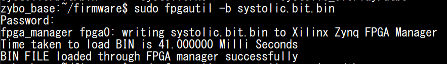

Load device tree overlay:

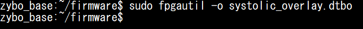

### Running it on the board {#running-it-on-the-board}

Now on board:

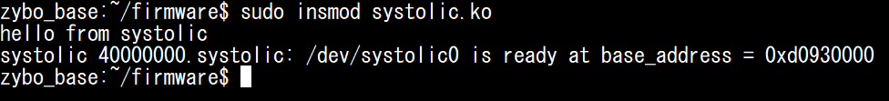

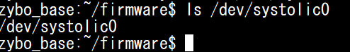

Here we can see that our IP is now registered as a node under /dev/. Now this node can be used in our userspace application as an interface to talk to our IP. Right now, think of this node as a door which can now be open and closed. However, there's no pathway ahead that door through which we can reach our IP. We start creating those roads and pathways next.

First we remove this loaded driver:

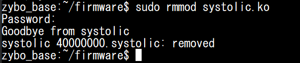

## Step 3 - IOCTL register read and write {#step-3-ioctl-register-read-and-write}

In this step we'll add the capability in our driver so we can read and write our IPs registers using a userspace application.


#include <linux/module.h>
#include <linux/init.h>
#include <linux/kernel.h>
#include <linux/of.h>
#include <linux/miscdevice.h>
#include <linux/platform_device.h>
#include <linux/fs.h>
#include <linux/io.h>
#include <linux/iopoll.h>
#include <linux/uaccess.h>

#define DRIVER_NAME "systolic"

#define SYSTOLIC_MAGIC  's'
#define SYSTOLIC_START  _IO (SYSTOLIC_MAGIC, 1)
#define SYSTOLIC_SET_N  _IOW(SYSTOLIC_MAGIC, 2, int)
#define SYSTOLIC_GET_N  _IOR(SYSTOLIC_MAGIC, 3, int)
#define SYSTOLIC_STATUS _IOR(SYSTOLIC_MAGIC, 4, __u32)

#define MAX_N       2048
#define REG_AP_CTRL 0x00
#define REG_N       0x34
#define AP_START    BIT(0)
#define AP_DONE     BIT(1)

struct systolic_dev {
    struct miscdevice miscdev;
    void __iomem     *base;

};

static const struct of_device_id systolic_of_match[] = {
    {
        .compatible = "rafae,systolic_driver-1.0",
    },
    {}
};

static int systolic_open(struct inode *inode, struct file *f)
{
    f->private_data = container_of(f->private_data, struct systolic_dev, miscdev);
    return 0;
}

static int systolic_release(struct inode *inode, struct file *f)
{
    return 0;
}

static long systolic_ioctl(struct file *f, unsigned int cmd, unsigned long arg)
{
    struct systolic_dev *priv = f->private_data;
    u32 val;

    switch (cmd) {
    case SYSTOLIC_SET_N:
        if (get_user(val, (int __user *)arg))
            return -EFAULT;
        if (val < 1 || val > MAX_N)
            return -EINVAL;
        writel(val, priv->base + REG_N);
        return 0;

    case SYSTOLIC_GET_N:
        val = readl(priv->base + REG_N);
        return put_user(val, (int __user *)arg) ? -EFAULT : 0;

    case SYSTOLIC_STATUS:
        val = readl(priv->base + REG_AP_CTRL);
        return put_user(val, (__u32 __user *)arg) ? -EFAULT : 0;

    case SYSTOLIC_START:
        writel(AP_START, priv->base + REG_AP_CTRL);
        return readl_poll_timeout(priv->base + REG_AP_CTRL, val,
                      val & AP_DONE, 10, 1000000);

    default:
        return -ENOTTY;
    }
}

static const struct file_operations systolic_fops = {
    .owner = THIS_MODULE,
    .open           = systolic_open,
    .release        = systolic_release,
    .unlocked_ioctl = systolic_ioctl,
};

static int systolic_probe(struct platform_device *pdev)
{
    struct systolic_dev *priv;
    int rc;

    priv = devm_kzalloc(&pdev->dev, sizeof(*priv), GFP_KERNEL);
    if (!priv)
        return -ENOMEM;

    priv->base = devm_platform_ioremap_resource(pdev, 0);
    if (IS_ERR(priv->base))
        return PTR_ERR(priv->base);

    priv->miscdev.minor  = MISC_DYNAMIC_MINOR;
    priv->miscdev.name   = "systolic0";
    priv->miscdev.fops   = &systolic_fops;

    rc = misc_register(&priv->miscdev);
    if (rc)
        return rc;

    platform_set_drvdata(pdev, priv);
    dev_info(&pdev->dev, "/dev/%s is ready at base_address = 0x%08x\n", priv->miscdev.name, priv->base);
    return 0;
}

static int systolic_remove(struct platform_device *pdev)
{
    struct systolic_dev *priv = platform_get_drvdata(pdev);

    misc_deregister(&priv->miscdev);
    dev_info(&pdev->dev, "removed\n");
    return 0;
}

static struct platform_driver systolic_driver = {
        .probe = systolic_probe,
        .remove = systolic_remove,
        .driver = {
            .name = DRIVER_NAME,
            .of_match_table = systolic_of_match,
    },
};

static int systolic_init (void){
    printk("hello from systolic\r\n");
    return platform_driver_register(&systolic_driver);
}

static void systolic_exit(void){
    printk("Goodbye from systolic\r\n");
    platform_driver_unregister(&systolic_driver);
}

module_init(systolic_init);
module_exit(systolic_exit);
MODULE_LICENSE("GPL");
MODULE_DESCRIPTION("Provide interface to systolic IP for fast matmul operation");
MODULE_AUTHOR("Rafae");


Lets see the changes from the start:

### IOCTL commands {#ioctl-commands}

[`SYSTOLIC_MAGIC`](#s3-L15) - the magic number is a 8 bit identifier per driver. It should be unique per driver ( kernel won't through any error if two drivers have same magic number but its better for error handling). Then 1 2 3 4 are command numbers for each unique ioctl command in this driver. The third is the type of argument passed from or to userspace. IO does not take or pass anything, IOW takes the value to write from userspace,  and IOR reads a value back to userspace.
These headers are then called [IOCTL commands](#ioctl-commands) and can then simply be used to read and write IPs registers from userspace.

[`SYSTOLIC_START`](#s3-L16): can be used to start the IP operation.
[`SYSTOLIC_SET_N`](#s3-L17) can be used to write matrix size N to IP register
[`SYSTOLIC_GET_N`](#s3-L18) can be used to read matrix size N from IP register
[`SYSTOLIC_STATUS`](#s3-L19) can be used to read status register from IP.
However, right now these are just IOCTL headers and not doing anything. We use these in the ioctl function. But first a few more headers:

### Register offsets {#register-offsets}

These are the register offsets of the registers in our IP's register space.

BIT(0) means 1 left shifted by 0 so just 1.

[`REG_AP_CTRL`](#s3-L22) is the control register and [`REG_N`](#s3-L23) is the matrix size register. [`AP_START`](#s3-L24) is BIT(0), so 1 left shifted by 0, just 1. [`AP_DONE`](#s3-L25) is BIT(1), so 1 left shifted by 1, i.e. 10 in binary, so 2.

### systolic_open and systolic_release {#systolic_open_release}

In systolic_open we retrieve the pointer to our struct from the kernel that was created in probe function and that we povided to kernel at the end of probe function to preserve it. This is then passed on to other functions like [systolic_ioctl](#systolic_ioctl-s3) as we'll see below.

systolic_release() is empty because we're not allocating any new memory in open(), therefore there nothing to clean up in release.

### systolic_ioctl {#systolic_ioctl-s3}

This is the function that will use the IOCTL commands header we defined above and do the actual register read and write.

We first get the pointer to our struct which we retrieved from kernel in [`systolic_open()`](#systolic_open_release) above, then we check what the ioctl command is that is called using a switch case. For each command type, if its a command that writes a value, then we use [`get_user()`](#s3-L63) function to get the value from userspace, and if the command reads a value back to userspace then we use [`put_user()`](#s3-L72) command to give the value back to userspace.

[`writel`](#s3-L67) (write long) and [`readl`](#s3-L71) (read long) are the functions that writes and reads the data to and from the IP registers respectively.

Hardware devices in linux kernel are treated as files. In our IP's case as well we saw above it appeared as file node /dev/systolic0.
So like any file, if we want to talk to it, we need to open it first. And we are done using it, we need to close it. That's what open and release functions are for. 

### file_operations struct {#file_operations}

We also have to map our function names to the names kernel understand, for this we use the [`file_operations`](#s3-L88) struct:. Kernel doesnt know about which of these [`systolic_release()`](#s3-L50), [`systolic_open`](#s3-L44), [`systolic_ioctl`](#s3-L56) etc to use for which function call from userspace, it know about  [`.open`](#s3-L90) when open() is called in userspace  [`.release`](#s3-L91) when close is called in userspace,  [`.unlocked_ioctl`](#s3-L92) when ioctl() is called in userspace etc. So we tell the kernel using this struct which of our function names maps to the names it understands so it can use them according to their call.

### The userspace application {#the-userspace-application-s3}

Now we need a userspace application as well to test our added calls in the driver. And check if we can talk to our IP through it.


#include <stdio.h>
#include <stdlib.h>
#include <stdint.h>
#include <fcntl.h>
#include <unistd.h>
#include <sys/ioctl.h>

#define SYSTOLIC_MAGIC   's'
#define SYSTOLIC_START   _IO (SYSTOLIC_MAGIC, 1)
#define SYSTOLIC_SET_N   _IOW(SYSTOLIC_MAGIC, 2, int)
#define SYSTOLIC_GET_N   _IOR(SYSTOLIC_MAGIC, 3, int)
#define SYSTOLIC_STATUS  _IOR(SYSTOLIC_MAGIC, 4, uint32_t)

int main(int argc, char **argv)
{
    int n = (argc > 1) ? atoi(argv[1]) : 4;
    int readback = 0;
    uint32_t status = 0;

    int fd = open("/dev/systolic0", O_RDWR);
    if (fd < 0) {
        printf("cannot open /dev/systolic0\n");
        return 1;
    }

    ioctl(fd, SYSTOLIC_SET_N,  &n);
    ioctl(fd, SYSTOLIC_GET_N,  &readback);
    ioctl(fd, SYSTOLIC_STATUS, &status);

    printf("N written : %d\n", n);
    printf("N read    : %d\n", readback);
    printf("AP_CTRL   : 0x%08x\n", status);

    close(fd);
    return 0;
}


In our case, since we’re writing our own driver we know about the magic number and ioctl command numbers, however, while providing the driver and IP to customer, these will be included in a header file which the user can then just include it and use the ioctl commands without defining these in their application themselves.

As discussed above, hardware devices are treated as files in kernel so we use [`open`](#s3app-L20) to first open our IP's file node to be able to talk to this. This in turn will call the [`systolic_open`](#s3-L44) call in our driver and perform the operations defined in it.

Then we use the ioctl command to read and write the registers. This will call to system_ioctl function in our driver and it will read/write the required register according to the passed ioctl command here. 

After running the application, we get the following output:

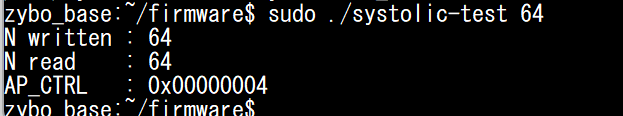

We can view this value being provided to our IP through the [AXI-lite](#how-the-ip-works) interface using ILA.

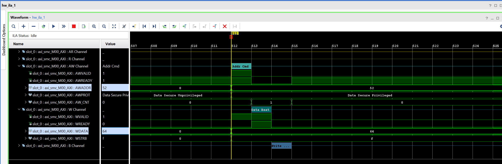

Here AW Channel is the address channel of AXI-lite and W channel is write data channel. we can see that at value 64 is being written at address 52 (decimal, `0x34` in hex) which is the address for [register N](#reg-n)

Similarly, if we write value 128 using our userspace application, we can see value 128 being written at address 52 (`0x34` in hex)

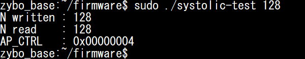

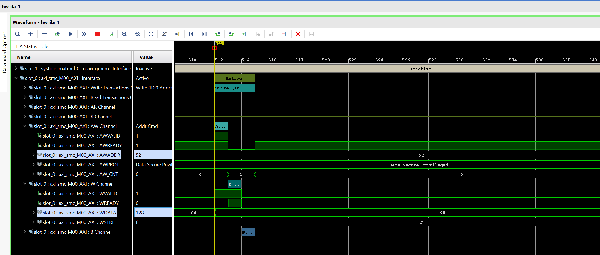

We can use devmem command as well to verify the value written at the register. devmem is a command which can be used to read/write memory from shell using physical addresses.

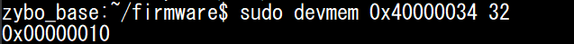

Where 0x40000034 is the register address for [N](#reg-n).

## Step 4 - DMA buffers and read/write {#step-4-dma-buffers-and-the-data-path}

Now we are ready to implement read/write functionality through DMA to provide data to the IP for computation and read it back. 

{% highlight c linenos mark_lines="5 12 13 23 24 25 27 28 31 32 33 41 43 45 46 47 48 51 52 53 54 55 56 58 59 60 61 62 63 64 65 66 67 68 69 70 71 72 74 75 76 77 78 79 80 81 82 83 84 85 86 87 88 89 90 91 92 93 94 95 96 97 98 99 100 101 102 103 104 105 106 107 108 109 122 123 124 125 126 127 128 129 130 131 132 133 134 135 136 137 138 139 140 141 142 143 144 145 146 147 148 149 150 151 152 153 154 155 156 157 158 159 160 161 162 163 164 166 167 168 169 170 171 172 173 174 175 176 177 178 179 180 181 182 183 184 185 186 191 192 196 198 199 200 203 204 205 206 207 208 209 210 211 212 215 216 217 218 221 222 223 224 227 228 229 230 231 233 234 235 236 237 248 249 262 263 269 270 271 272 273 274 275 276 281 285 289 292 293 294 302 303 320 321" %}
#include <linux/module.h>
#include <linux/init.h>
#include <linux/kernel.h>
#include <linux/of.h>
#include <linux/of_reserved_mem.h>
#include <linux/miscdevice.h>
#include <linux/platform_device.h>
#include <linux/fs.h>
#include <linux/io.h>
#include <linux/iopoll.h>
#include <linux/uaccess.h>
#include <linux/dma-mapping.h>
#include <linux/mutex.h>

#define DRIVER_NAME "systolic"

#define SYSTOLIC_MAGIC  's'
#define SYSTOLIC_START  _IO (SYSTOLIC_MAGIC, 1)
#define SYSTOLIC_SET_N  _IOW(SYSTOLIC_MAGIC, 2, int)
#define SYSTOLIC_GET_N  _IOR(SYSTOLIC_MAGIC, 3, int)
#define SYSTOLIC_STATUS _IOR(SYSTOLIC_MAGIC, 4, __u32)

/* the IP works in 64x64 tiles, so the matrix size must be a multiple of it */
#define TILE_SIZE       64
#define MAX_MATRIX_SIZE     2048

#define AB_BYTES(size)  ((size_t)(size) * (size) * sizeof(s16))
#define C_BYTES(size)   ((size_t)(size) * (size) * sizeof(s64))

#define REG_AP_CTRL 0x00
#define REG_A       0x10
#define REG_B       0x1c
#define REG_C       0x28
#define REG_N       0x34

#define AP_START    BIT(0)
#define AP_DONE     BIT(1)

struct systolic_dev {
    struct miscdevice miscdev;
    struct device    *dev;      /* dma_* needs this outside probe */
    void __iomem     *base;
    struct mutex      lock;

    int       matrix_size;  /* 0 = nothing allocated yet */
    s16      *a, *b;
    s64      *c;
    dma_addr_t    a_dma, b_dma, c_dma;
};

/* the pointer registers are 64-bit, split across two 32-bit words */
static void systolic_set_ptr(struct systolic_dev *priv, u32 reg, dma_addr_t addr)
{
    writel(lower_32_bits(addr), priv->base + reg);
    writel(upper_32_bits(addr), priv->base + reg + 4);
}

static void systolic_free_buffers(struct systolic_dev *priv)
{
    int size = priv->matrix_size;

    if (!size)
        return;

    dma_free_coherent(priv->dev, AB_BYTES(size), priv->a, priv->a_dma);
    dma_free_coherent(priv->dev, AB_BYTES(size), priv->b, priv->b_dma);
    dma_free_coherent(priv->dev, C_BYTES(size),  priv->c, priv->c_dma);

    priv->a = priv->b = NULL;
    priv->c = NULL;
    priv->matrix_size = 0;
}

static int systolic_alloc_buffers(struct systolic_dev *priv, int matrix_size)
{
    size_t ab = AB_BYTES(matrix_size);

    priv->a = dma_alloc_coherent(priv->dev, ab, &priv->a_dma, GFP_KERNEL);
    if (!priv->a)
        return -ENOMEM;

    priv->b = dma_alloc_coherent(priv->dev, ab, &priv->b_dma, GFP_KERNEL);
    if (!priv->b)
        goto free_a;

    priv->c = dma_alloc_coherent(priv->dev, C_BYTES(matrix_size),
                     &priv->c_dma, GFP_KERNEL);
    if (!priv->c)
        goto free_b;

    priv->matrix_size = matrix_size;

    /* the addresses changed, so the IP has to be told again */
    systolic_set_ptr(priv, REG_A, priv->a_dma);
    systolic_set_ptr(priv, REG_B, priv->b_dma);
    systolic_set_ptr(priv, REG_C, priv->c_dma);
    writel(matrix_size, priv->base + REG_N);

    dev_info(priv->dev, "size=%d: a=%pad b=%pad c=%pad\n",
         matrix_size, &priv->a_dma, &priv->b_dma, &priv->c_dma);
    return 0;

free_b:
    dma_free_coherent(priv->dev, ab, priv->b, priv->b_dma);
free_a:
    dma_free_coherent(priv->dev, ab, priv->a, priv->a_dma);
    priv->a = priv->b = NULL;
    return -ENOMEM;
}

static int systolic_open(struct inode *inode, struct file *f)
{
    f->private_data = container_of(f->private_data, struct systolic_dev, miscdev);
    return 0;
}

static int systolic_release(struct inode *inode, struct file *f)
{
    return 0;
}

/* the input region is A followed by B, and the position says which one */
static ssize_t systolic_write(struct file *f, const char __user *buf,
                  size_t count, loff_t *ppos)
{
    struct systolic_dev *priv = f->private_data;
    size_t size;
    void *dst;
    ssize_t rc;

    mutex_lock(&priv->lock);

    if (!priv->matrix_size) {
        rc = -ENXIO;            /* SET_N not called yet */
        goto out;
    }

    size = AB_BYTES(priv->matrix_size);

    if (count != size) {
        rc = -EINVAL;
        goto out;
    }

    if (*ppos == 0)
        dst = priv->a;
    else if (*ppos == size)
        dst = priv->b;
    else {
        rc = -EINVAL;
        goto out;
    }

    if (copy_from_user(dst, buf, count)) {
        rc = -EFAULT;           /* position unchanged, safe to retry */
        goto out;
    }

    *ppos = (*ppos == 0) ? size : 0;    /* A -> B -> A */
    rc = count;
out:
    mutex_unlock(&priv->lock);
    return rc;
}

/* one read returns all of C; there is only one output, so position is unused */
static ssize_t systolic_read(struct file *f, char __user *buf,
                 size_t count, loff_t *ppos)
{
    struct systolic_dev *priv = f->private_data;
    ssize_t rc;

    mutex_lock(&priv->lock);

    if (!priv->matrix_size)
        rc = -ENXIO;
    else if (count != C_BYTES(priv->matrix_size))
        rc = -EINVAL;
    else if (copy_to_user(buf, priv->c, count))
        rc = -EFAULT;
    else
        rc = count;

    mutex_unlock(&priv->lock);
    return rc;
}

static long systolic_ioctl(struct file *f, unsigned int cmd, unsigned long arg)
{
    struct systolic_dev *priv = f->private_data;
    int matrix_size, rc;
    u32 status;

    switch (cmd) {
    case SYSTOLIC_SET_N:
        if (get_user(matrix_size, (int __user *)arg))
            return -EFAULT;
        if (matrix_size < TILE_SIZE ||
            matrix_size > MAX_MATRIX_SIZE ||
            matrix_size % TILE_SIZE)
            return -EINVAL;

        mutex_lock(&priv->lock);
        if (matrix_size == priv->matrix_size) {
            rc = 0;         /* same size, keep the buffers */
        } else {
            /* free first: at 2048 we cannot hold both sets */
            systolic_free_buffers(priv);
            rc = systolic_alloc_buffers(priv, matrix_size);
        }
        mutex_unlock(&priv->lock);
        return rc;

    case SYSTOLIC_GET_N:
        matrix_size = readl(priv->base + REG_N);
        if (put_user(matrix_size, (int __user *)arg))
            return -EFAULT;
        return 0;

    case SYSTOLIC_STATUS:
        status = readl(priv->base + REG_AP_CTRL);
        if (put_user(status, (__u32 __user *)arg))
            return -EFAULT;
        return 0;

    case SYSTOLIC_START:
        mutex_lock(&priv->lock);
        if (!priv->matrix_size) {
            mutex_unlock(&priv->lock);
            return -ENXIO;
        }
        writel(AP_START, priv->base + REG_AP_CTRL);
        /* 1 ms between reads, 60 s limit: 2048 takes ~18 s */
        rc = readl_poll_timeout(priv->base + REG_AP_CTRL, status,
                    status & AP_DONE, 1000, 60000000);
        mutex_unlock(&priv->lock);
        return rc;

    default:
        return -ENOTTY;
    }
}

static const struct file_operations systolic_fops = {
    .owner      = THIS_MODULE,
    .open       = systolic_open,
    .release    = systolic_release,
    .read       = systolic_read,
    .write      = systolic_write,
    .unlocked_ioctl = systolic_ioctl,
};

static int systolic_probe(struct platform_device *pdev)
{
    struct systolic_dev *priv;
    int rc;

    priv = devm_kzalloc(&pdev->dev, sizeof(*priv), GFP_KERNEL);
    if (!priv)
        return -ENOMEM;

    priv->dev = &pdev->dev;
    mutex_init(&priv->lock);

    priv->base = devm_platform_ioremap_resource(pdev, 0);
    if (IS_ERR(priv->base))
        return PTR_ERR(priv->base);

    /* attach the memory-region from the device tree, so every
     * dma_alloc_coherent below comes out of our reserved 64 MB
     */
    rc = of_reserved_mem_device_init(&pdev->dev);
    if (rc) {
        dev_err(&pdev->dev, "no usable memory-region (%d)\n", rc);
        return rc;
    }

    priv->miscdev.minor = MISC_DYNAMIC_MINOR;
    priv->miscdev.name  = "systolic0";
    priv->miscdev.fops  = &systolic_fops;
    priv->miscdev.parent    = &pdev->dev;

    rc = misc_register(&priv->miscdev);
    if (rc)
        goto err_rmem;

    platform_set_drvdata(pdev, priv);

    dev_info(&pdev->dev, "ready at 0x%08x, buffers allocated on SET_N\n", priv->base);
    return 0;

err_rmem:
    of_reserved_mem_device_release(&pdev->dev);
    return rc;
}

static int systolic_remove(struct platform_device *pdev)
{
    struct systolic_dev *priv = platform_get_drvdata(pdev);

    misc_deregister(&priv->miscdev);
    systolic_free_buffers(priv);
    of_reserved_mem_device_release(&pdev->dev);
    dev_info(&pdev->dev, "removed\n");
    return 0;
}

static const struct of_device_id systolic_of_match[] = {
    {
        .compatible = "rafae,systolic_driver-1.0",
    },
    {}
};

static struct platform_driver systolic_driver = {
    .driver = {
        .name       = DRIVER_NAME,
        .of_match_table = systolic_of_match,
    },
    .probe  = systolic_probe,
    .remove = systolic_remove,
};

static int systolic_init (void){
    printk("hello from systolic\r\n");
    return platform_driver_register(&systolic_driver);
}

static void systolic_exit(void){
    printk("Goodbye from systolic\r\n");
    platform_driver_unregister(&systolic_driver);
}

module_init(systolic_init);
module_exit(systolic_exit);

MODULE_LICENSE("GPL");
MODULE_DESCRIPTION("Provide interface to systolic IP for fast matmul operation");
MODULE_AUTHOR("Rafae");


### New headers {#new-headers}

[`TILE_SIZE`](#s4-L24) is the tile size the IP works on, so the matrix size has to be a multiple of it. [`MAX_MATRIX_SIZE`](#s4-L25) is the largest size we allow. Both are used to reject a bad size before we allocate anything.

[`AB_BYTES`](#s4-L27) and [`C_BYTES`](#s4-L28) work out how many bytes a matrix needs for a given size. A and B hold 16 bit values so they use s16, while C holds the accumulated result so it uses s64 and takes four times the memory for the same n.

[`REG_A`](#s4-L31), [`REG_B`](#s4-L32) and [`REG_C`](#s4-L33) are the register offsets for the buffer addresses for A, B and C matrix. [`REG_AP_CTRL`](#s4-L30) is the control register we already used in the previous step.

### systolic_dev struct {#systolic_dev-struct}

Then we have to update the [`systolic_dev`](#s4-L39) struct for buffer pointers, mutex lock to handle multiple userspace applications trying to access the IP and dev.

The IP registers need physical addresses for the buffers. But [`s16 *a *b`](#s4-L46) and [`s64 *c`](#s4-L47) will provide the virtual addressses. Hence [`dma_addr_t`](#s4-L48) is used to write map those virtual addresses to physical address and write to the IP registers. [`mutex lock`](#s4-L43) is used so only one application can access the IP at a time, as our current IP has only one channel.

### systolic_set_ptr {#systolic_set_ptr}

[`systolic_set_ptr`](#s4-L52) - this function is to write the buffer addresses to IP register. So that the IP knows where to read data from for computation and where to write it back. Since the IP takes a 64 bit address divided into two 32 bit register, we have to perform two 32 bit writes on  two registers.

### systolic_alloc_buffers {#systolic_alloc_buffers}

[`systolic_alloc_buffers`](#s4-L74) - we use this function to allocate memory to the buffers a b and c in kernel space a. [`dma_alloc_coherent`](#s4-L78) is the kernel API that can be used to allocate memory to our buffers from reserved memory region in our device tree (We'll see the updated device tree for this later in this section)
For each buffer: [`dma_alloc_coherent`](#s4-L78) -  we give the function the dev struct created by kernel (dev contains the information about the reserved memory region this IP can use) and the size, and the function writes the allocated physical address to [`priv->a_dma`](#s4-L78) and returns the virtual address to [`priv->a`](#s4-L78).
After allocating the buffers we provide their pointer to the IP using [`systolic_set_ptr`](#s4-L52) function. notice that we use priv->a_dma instead of priv->a because the IP needs physical address.

### systolic_free_buffers {#systolic_free_buffers}

[`systolic_free_buffers`](#s4-L58) - we use this function to free up the alloacted buffers

### systolic_write {#systolic_write-s4}

First the function takes the mutex lock so no other process can initiate a transfer while one is on going as there is only one IP in the design. Here the read and write is from perspective of userspace application, not the IP.

Since there is only one write path but two different possible destinations (i.e matrix A and B), we need a way to tell the driver which matrix data is currently being written, either A or B. we use ppos for that. ppos is used to tell the current location in file. This really doesn't have any real meaning here and we're just using it as a distinguisher, we alternate it between [`ppos=0`](#s4-L145) for first matrix and then [`ppos=size`](#s4-L159) for the second matrix. And using these we set the destination for the incoming data. we use the [`copy_from_user`](#s4-L154) function to copy the data from userspace memory to kernel space memory.

Note that copy_from_user copies the whole matrix from userspace into the DMA buffer, so the CPU walks over all the data once before the IP even starts. For a big matrix that copy will cost alot of cycles which is not good. There are better ways to do this but for now to keep it simple we'll just use this.

### systolic_read {#systolic_read-s4}

for read, its much simpler because we only have one buffer to write. 

It just does some error checking, take the mutex lock and then copy the data back to userspace using [`copy_to_user()`](#s4-L179).

### systolic_ioctl {#systolic_ioctl-s4}

In [`IOCTL fuction`](#s4-L188), the following cases are updated:

[`SYSTOLIC_SET_N`](#s4-L195): It checks if if the new provided N value from userspace is same as before (if the application has been run before). Then it won't do anything as the previously allocated buffers can be used again. If the size is different(or if its a first run), then it will first free the previously allocated buffers using [`systolic_free_buffers`](#s4-L58) and then allocate using [`systolic_alloc_buffers`](#s4-L74).

[`SYSTOLIC_START`](#s4-L226): It'll set the start bit of the IP, telling it to start reading data of matrix A and B using the DMA through [AXI-Full](#how-the-ip-works) interface, then we poll the status register to wait for the completion of matrix multiplication.

### systolic_probe {#systolic_probe-s4}

We need to make a few changes in probe function as well. 
[`of_reserved_mem_device_init`](#s4-L272): it connects the memory-region from the device tree to this device, so that every later dma_alloc_coherent on it comes out of your reserved 64 MB instead of the kernel's general pool. It stores that info in dev, that's why need to add this to our systolic struct so we can use this dev later for dma operations.

### file_operations {#file_operations_s4}

In [`file_operation`](#s4-L244) struct, we have to make to new entries for two added system calls of [`systolic_read`](#s4-L248) and [`systolic_write`](#s4-L249).

### systolic_remove {#systolic_remove-s4}

For [`systolic_remove`](#s4-L297) we deallocate the buffers and release the attached memory region defined in device tree.

### Device tree update {#device-tree-update}

dma_alloc_coherent needs a reserved memory region in the device tree. We cannot use kzalloc for reverving this memory as DMA operations usually needs large contigous buffers. and kzalloc cannot provide large contiguous buffers. So using the device tree we tell the kernel to reserve some memory for DMA buffers and then the kernels DMA APIs can allocate buffers in this region.

However, this memory needs to be reserved at boot time, so we cannot add it in the overlay and will have to add this node in the main device tree which is loaded at boot time. 
We need to add the following node:


    reserved-memory {
        #address-cells = <0x01>;
        #size-cells = <0x01>;
        ranges;

        systolic_reserved: systolic@1c000000 {
            compatible = "shared-dma-pool";
            reusable;
            reg = <0x1c000000 0x4000000>;
        };
    };


[`reg = <0x1c000000 0x4000000>;`](#s4dt-L9) Defines the starting address of our reserved memory and its size. `ranges;` with nothing after it means a 1:1 mapping, so an address inside a child node is the same address the CPU uses. If it were `ranges = <0x0 0x1c000000 0x4000000>;` instead, a child sitting at `0x0` would really be at `0x1c000000`, and every address in that node would be offset by the same amount.

[`reusable;`](#s4dt-L8) Means the kernel can use it for other operations as long as we're not using it, whenever our DMA needs this region, kernel will clear it up and provide this to the DMA.
[`compatible = "shared-dma-pool";`](#s4dt-L7) is used so that the kernel knows its for dma and we can access it through the dma apis in the driver.

We then compile it using following command:

dtc -@ -I dts -O dtb system.dts -o system.dtb

The -@ is use to convert the labels([`systolic_reserved`](#s4dt-L6) here) to symbols like:

Symbols are then used to reference the nodes in main device tree from overlay device tree.

### Device tree overlay {#device-tree-overlay-s4}

In overlay device tree:


/dts-v1/;
/plugin/;

&amba {
    #address-cells = <1>;
    #size-cells = <1>;
    systolic@40000000{
        compatible = "rafae,systolic_driver-1.0";
        reg = <0x40000000 0x10000>;
        memory-region = <&systolic_reserved>;
    };
};


We just add the [`memory-region`](#s4ov-L10) node and use the label that we added in the main device tree. This tells the kernel that this node can use that reserved memory region. And we use [`&systolic_reserved`](#s4ov-L10) to tell it to reference the node in main device tree that it needs to reference to get info about the reserved memory region.

### The userspace application {#the-userspace-application-s4}

In the userspace application, we now create matrix A and B. We make B as identity matrix so the output result is simply matrix A and can be checked easily. 


#include <stdio.h>
#include <stdlib.h>
#include <stdint.h>
#include <fcntl.h>
#include <unistd.h>
#include <sys/ioctl.h>

#define SYSTOLIC_MAGIC   's'
#define SYSTOLIC_START   _IO (SYSTOLIC_MAGIC, 1)
#define SYSTOLIC_SET_N   _IOW(SYSTOLIC_MAGIC, 2, int)
#define SYSTOLIC_GET_N   _IOR(SYSTOLIC_MAGIC, 3, int)
#define SYSTOLIC_STATUS  _IOR(SYSTOLIC_MAGIC, 4, uint32_t)

int main(int argc, char **argv)
{
    int n = (argc > 1) ? atoi(argv[1]) : 64;
    int readback = 0;
    uint32_t status = 0;
    int i, errors = 0;

    int16_t *a, *b;
    int64_t *c;

    int fd = open("/dev/systolic0", O_RDWR);
    if (fd < 0) {
        printf("cannot open /dev/systolic0\n");
        return 1;
    }

    if (ioctl(fd, SYSTOLIC_SET_N, &n) < 0) {
        printf("size %d rejected (multiple of 64, max 2048)\n", n);
        return 1;
    }

    a = malloc(sizeof(int16_t) * n * n);
    b = malloc(sizeof(int16_t) * n * n);
    c = malloc(sizeof(int64_t) * n * n);

    /* A = counting pattern, B = identity, so C should come back equal to A */
    for (i = 0; i < n * n; i++) {
        a[i] = (int16_t)(i % 100);
        b[i] = (i / n == i % n) ? 1 : 0;
    }

    write(fd, a, sizeof(int16_t) * n * n);      /* -> A */
    write(fd, b, sizeof(int16_t) * n * n);      /* -> B */

    if (ioctl(fd, SYSTOLIC_START) < 0) {
        printf("START failed (timeout?)\n");
        return 1;
    }

    read(fd, c, sizeof(int64_t) * n * n);

    for (i = 0; i < n * n; i++)
        if (c[i] != a[i])
            errors++;

    ioctl(fd, SYSTOLIC_GET_N,  &readback);
    ioctl(fd, SYSTOLIC_STATUS, &status);

    printf("N written : %d\n", n);
    printf("N read    : %d\n", readback);
    printf("AP_CTRL   : 0x%08x\n", status);
    printf("result    : %s (%d mismatches)\n", errors ? "FAIL" : "PASS", errors);

    free(a);
    free(b);
    free(c);
    close(fd);
    return errors ? 1 : 0;
}


We use write function to provide the data for matrix A and B to the driver. This will call the systolic_write function in driver.
Then we start the IP and poll to check IP completion. Once done we read the result buffer back in userspace and compare with expected output( which i matrix A in our case)

But how can malloc provide contiguous memory when kzalloc couldn't, and we had to reserve a region in the device tree for the driver's buffers?

malloc does not give us physically contiguous memory, and it doesn't need to. What it gives is virtually contiguous memory, so `a[0]` to `a[n*n-1]` are next to each other as far as the application is concerned, while the pages behind them can be scattered anywhere in RAM. That is fine here because the IP never sees these pointers. write() hands the buffer to the driver, the driver copies it into the `dma_alloc_coherent` buffer, and that one is physically contiguous because it comes out of the region we reserved in the device tree. If we tried to give the IP a malloc'd pointer directly it would read the wrong memory as soon as the buffer crossed a page boundary.

Now we test on board:

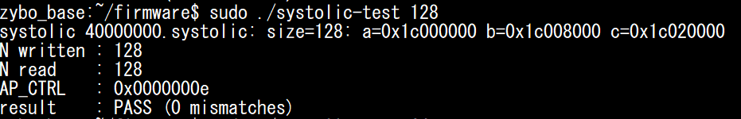

The driver prints the three buffer addresses it allocated, and those are the same values going out on the bus in the capture below. Each address register is 64 bit split across two 32 bit registers, so every buffer takes two writes, low half first:

| Offset | Register | Value written | From the terminal |
| --- | --- | --- | --- |
| `0x10` | [`REG_A`](#s4-L31) low  | `1c000000` | `a=0x1c000000` |
| `0x14` | [`REG_A`](#s4-L31) high | `00000000` | |
| `0x1c` | [`REG_B`](#s4-L32) low  | `1c008000` | `b=0x1c008000` |
| `0x20` | [`REG_B`](#s4-L32) high | `00000000` | |
| `0x28` | [`REG_C`](#s4-L33) low  | `1c020000` | `c=0x1c020000` |
| `0x2c` | [`REG_C`](#s4-L33) high | `00000000` | |
| `0x34` | [`REG_N`](#s4-L34)      | `00000080` | `size=128` |

We can see these values being provided to their registers from the addr channel and write data channel in below screenshot.
The high halves are all zero because the reserved region sits in the low 4GB, and `0x80` is just 128 in hex, the size we passed on the command line. All three addresses fall inside the `0x1c000000` region we reserved in the device tree, and `b` is `0x8000` above `a`, which is exactly one 128x128 matrix of s16. 

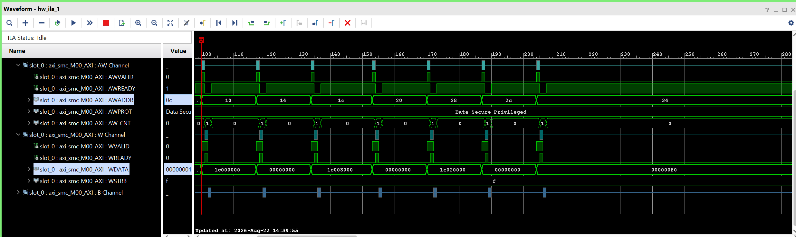

Note: The radix in these ss is hex, where as it the step 3 ss, it was decimal. That's my bad as I forgot to keep them same when taking the screenshots. The numbers are same just their format is different. So don't be confused by that.

After IP is started, we can see data traffic on the AXI-Full interface. (here only writing back of result is shown).

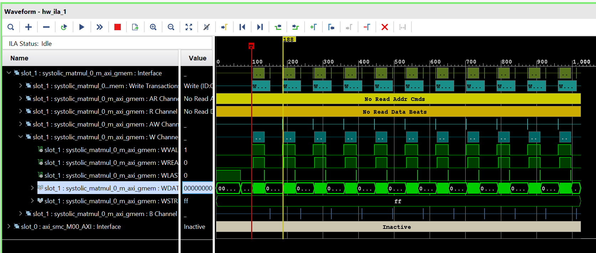

## Step 5 - interrupts {#step-5-interrupts}

This will be our final step, we will add interrupt handling capability in our driver so we wont have to poll and waste CPU cycles.


#include <linux/module.h>
#include <linux/init.h>
#include <linux/kernel.h>
#include <linux/of.h>
#include <linux/of_reserved_mem.h>
#include <linux/miscdevice.h>
#include <linux/platform_device.h>
#include <linux/fs.h>
#include <linux/io.h>
#include <linux/interrupt.h>
#include <linux/uaccess.h>
#include <linux/dma-mapping.h>
#include <linux/mutex.h>

#define DRIVER_NAME "systolic"

#define SYSTOLIC_MAGIC  's'
#define SYSTOLIC_START  _IO (SYSTOLIC_MAGIC, 1)
#define SYSTOLIC_SET_N  _IOW(SYSTOLIC_MAGIC, 2, int)
#define SYSTOLIC_GET_N  _IOR(SYSTOLIC_MAGIC, 3, int)
#define SYSTOLIC_STATUS _IOR(SYSTOLIC_MAGIC, 4, __u32)

/* the IP works in 64x64 tiles, so the matrix size must be a multiple of it */
#define TILE_SIZE       64
#define MAX_MATRIX_SIZE     2048

#define AB_BYTES(size)  ((size_t)(size) * (size) * sizeof(s16))
#define C_BYTES(size)   ((size_t)(size) * (size) * sizeof(s64))

#define REG_AP_CTRL 0x00
#define REG_GIE     0x04
#define REG_IER     0x08
#define REG_ISR     0x0c
#define REG_A       0x10
#define REG_B       0x1c
#define REG_C       0x28
#define REG_N       0x34

#define AP_START    BIT(0)
#define GIE_ENABLE  BIT(0)
#define IER_AP_DONE BIT(0)
#define ISR_AP_DONE BIT(0)

struct systolic_dev {
    struct miscdevice miscdev;
    struct device    *dev;      /* dma_* needs this outside probe */
    void __iomem     *base;
    struct mutex      lock;

    wait_queue_head_t wq;       /* read() sleeps here while the IP runs */
    bool          busy;     /* set by START, cleared by the ISR */

    int       matrix_size;  /* 0 = nothing allocated yet */
    s16      *a, *b;
    s64      *c;
    dma_addr_t    a_dma, b_dma, c_dma;
};

/* the pointer registers are 64-bit, split across two 32-bit words */
static void systolic_set_ptr(struct systolic_dev *priv, u32 reg, dma_addr_t addr)
{
    writel(lower_32_bits(addr), priv->base + reg);
    writel(upper_32_bits(addr), priv->base + reg + 4);
}

static irqreturn_t systolic_isr(int irq, void *data)
{
    struct systolic_dev *priv = data;

    writel(ISR_AP_DONE, priv->base + REG_ISR);  /* toggle-on-write clears it */
    priv->busy = false;
    wake_up_interruptible(&priv->wq);
    return IRQ_HANDLED;
}

static void systolic_free_buffers(struct systolic_dev *priv)
{
    int size = priv->matrix_size;

    if (!size)
        return;

    dma_free_coherent(priv->dev, AB_BYTES(size), priv->a, priv->a_dma);
    dma_free_coherent(priv->dev, AB_BYTES(size), priv->b, priv->b_dma);
    dma_free_coherent(priv->dev, C_BYTES(size),  priv->c, priv->c_dma);

    priv->a = priv->b = NULL;
    priv->c = NULL;
    priv->matrix_size = 0;
}

static int systolic_alloc_buffers(struct systolic_dev *priv, int matrix_size)
{
    size_t ab = AB_BYTES(matrix_size);

    priv->a = dma_alloc_coherent(priv->dev, ab, &priv->a_dma, GFP_KERNEL);
    if (!priv->a)
        return -ENOMEM;

    priv->b = dma_alloc_coherent(priv->dev, ab, &priv->b_dma, GFP_KERNEL);
    if (!priv->b)
        goto free_a;

    priv->c = dma_alloc_coherent(priv->dev, C_BYTES(matrix_size),
                     &priv->c_dma, GFP_KERNEL);
    if (!priv->c)
        goto free_b;

    priv->matrix_size = matrix_size;

    /* the addresses changed, so the IP has to be told again */
    systolic_set_ptr(priv, REG_A, priv->a_dma);
    systolic_set_ptr(priv, REG_B, priv->b_dma);
    systolic_set_ptr(priv, REG_C, priv->c_dma);
    writel(matrix_size, priv->base + REG_N);

    dev_info(priv->dev, "size=%d: a=%pad b=%pad c=%pad\n",
         matrix_size, &priv->a_dma, &priv->b_dma, &priv->c_dma);
    return 0;

free_b:
    dma_free_coherent(priv->dev, ab, priv->b, priv->b_dma);
free_a:
    dma_free_coherent(priv->dev, ab, priv->a, priv->a_dma);
    priv->a = priv->b = NULL;
    return -ENOMEM;
}

static int systolic_open(struct inode *inode, struct file *f)
{
    f->private_data = container_of(f->private_data, struct systolic_dev, miscdev);
    return 0;
}

static int systolic_release(struct inode *inode, struct file *f)
{
    return 0;
}

/* the input region is A followed by B, and the position says which one */
static ssize_t systolic_write(struct file *f, const char __user *buf,
                  size_t count, loff_t *ppos)
{
    struct systolic_dev *priv = f->private_data;
    size_t size;
    void *dst;
    ssize_t rc;

    mutex_lock(&priv->lock);

    if (!priv->matrix_size) {
        rc = -ENXIO;            /* SET_N not called yet */
        goto out;
    }
    if (priv->busy) {
        rc = -EBUSY;            /* the IP is reading these buffers */
        goto out;
    }

    size = AB_BYTES(priv->matrix_size);

    if (count != size) {
        rc = -EINVAL;
        goto out;
    }

    if (*ppos == 0)
        dst = priv->a;
    else if (*ppos == size)
        dst = priv->b;
    else {
        rc = -EINVAL;
        goto out;
    }

    if (copy_from_user(dst, buf, count)) {
        rc = -EFAULT;           /* position unchanged, safe to retry */
        goto out;
    }

    *ppos = (*ppos == 0) ? size : 0;    /* A -> B -> A */
    rc = count;
out:
    mutex_unlock(&priv->lock);
    return rc;
}

/* waits for the IP, then returns all of C; position is unused */
static ssize_t systolic_read(struct file *f, char __user *buf,
                 size_t count, loff_t *ppos)
{
    struct systolic_dev *priv = f->private_data;
    ssize_t rc;

    /* sleep until the ISR clears busy; returns at once if nothing is running */
    rc = wait_event_interruptible_timeout(priv->wq, !priv->busy, 60 * HZ);
    if (rc == 0)
        return -ETIMEDOUT;
    if (rc < 0)
        return rc;          /* a signal interrupted the wait */

    mutex_lock(&priv->lock);

    if (!priv->matrix_size)
        rc = -ENXIO;
    else if (count != C_BYTES(priv->matrix_size))
        rc = -EINVAL;
    else if (copy_to_user(buf, priv->c, count))
        rc = -EFAULT;
    else
        rc = count;

    mutex_unlock(&priv->lock);
    return rc;
}

static long systolic_ioctl(struct file *f, unsigned int cmd, unsigned long arg)
{
    struct systolic_dev *priv = f->private_data;
    int matrix_size, rc;
    u32 status;

    switch (cmd) {
    case SYSTOLIC_SET_N:
        if (get_user(matrix_size, (int __user *)arg))
            return -EFAULT;
        if (matrix_size < TILE_SIZE ||
            matrix_size > MAX_MATRIX_SIZE ||
            matrix_size % TILE_SIZE)
            return -EINVAL;

        mutex_lock(&priv->lock);
        if (priv->busy) {
            rc = -EBUSY;        /* would free buffers in use */
        } else if (matrix_size == priv->matrix_size) {
            rc = 0;         /* same size, keep the buffers */
        } else {
            /* free first: at 2048 we cannot hold both sets */
            systolic_free_buffers(priv);
            rc = systolic_alloc_buffers(priv, matrix_size);
        }
        mutex_unlock(&priv->lock);
        return rc;

    case SYSTOLIC_GET_N:
        matrix_size = readl(priv->base + REG_N);
        if (put_user(matrix_size, (int __user *)arg))
            return -EFAULT;
        return 0;

    case SYSTOLIC_STATUS:
        status = readl(priv->base + REG_AP_CTRL);
        if (put_user(status, (__u32 __user *)arg))
            return -EFAULT;
        return 0;

    case SYSTOLIC_START:
        mutex_lock(&priv->lock);
        if (!priv->matrix_size) {
            rc = -ENXIO;
        } else if (priv->busy) {
            rc = -EBUSY;
        } else {
            priv->busy = true;
            writel(AP_START, priv->base + REG_AP_CTRL);
            rc = 0;         /* returns at once; read() waits */
        }
        mutex_unlock(&priv->lock);
        return rc;

    default:
        return -ENOTTY;
    }
}

static const struct file_operations systolic_fops = {
    .owner      = THIS_MODULE,
    .open       = systolic_open,
    .release    = systolic_release,
    .read       = systolic_read,
    .write      = systolic_write,
    .unlocked_ioctl = systolic_ioctl,
};

static int systolic_probe(struct platform_device *pdev)
{
    struct systolic_dev *priv;
    int rc;

    priv = devm_kzalloc(&pdev->dev, sizeof(*priv), GFP_KERNEL);
    if (!priv)
        return -ENOMEM;

    priv->dev = &pdev->dev;
    mutex_init(&priv->lock);
    init_waitqueue_head(&priv->wq);

    priv->base = devm_platform_ioremap_resource(pdev, 0);
    if (IS_ERR(priv->base))
        return PTR_ERR(priv->base);

    /* attach the memory-region from the device tree, so every
     * dma_alloc_coherent below comes out of our reserved 64 MB
     */
    rc = of_reserved_mem_device_init(&pdev->dev);
    if (rc) {
        dev_err(&pdev->dev, "no usable memory-region (%d)\n", rc);
        return rc;
    }

    rc = platform_get_irq(pdev, 0);
    if (rc < 0)
        goto err_rmem;

    rc = devm_request_irq(&pdev->dev, rc, systolic_isr, 0, DRIVER_NAME, priv);
    if (rc)
        goto err_rmem;

    /* both must be set or the IP never raises the line */
    writel(IER_AP_DONE, priv->base + REG_IER);
    writel(GIE_ENABLE,  priv->base + REG_GIE);

    priv->miscdev.minor = MISC_DYNAMIC_MINOR;
    priv->miscdev.name  = "systolic0";
    priv->miscdev.fops  = &systolic_fops;
    priv->miscdev.parent    = &pdev->dev;

    rc = misc_register(&priv->miscdev);
    if (rc)
        goto err_rmem;

    platform_set_drvdata(pdev, priv);

    dev_info(&pdev->dev, "ready at 0x%08x, buffers allocated on SET_N\n", priv->base);
    return 0;

err_rmem:
    of_reserved_mem_device_release(&pdev->dev);
    return rc;
}

static int systolic_remove(struct platform_device *pdev)
{
    struct systolic_dev *priv = platform_get_drvdata(pdev);

    misc_deregister(&priv->miscdev);
    systolic_free_buffers(priv);
    of_reserved_mem_device_release(&pdev->dev);
    dev_info(&pdev->dev, "removed\n");
    return 0;
}

static const struct of_device_id systolic_of_match[] = {
    {
        .compatible = "rafae,systolic_driver-1.0",
    },
    {}
};

static struct platform_driver systolic_driver = {
    .driver = {
        .name       = DRIVER_NAME,
        .of_match_table = systolic_of_match,
    },
    .probe  = systolic_probe,
    .remove = systolic_remove,
};

static int systolic_init (void){
    printk("hello from systolic\r\n");
    return platform_driver_register(&systolic_driver);
}

static void systolic_exit(void){
    printk("Goodbye from systolic\r\n");
    platform_driver_unregister(&systolic_driver);
}

module_init(systolic_init);
module_exit(systolic_exit);

MODULE_LICENSE("GPL");
MODULE_DESCRIPTION("Provide interface to systolic IP for fast matmul operation");
MODULE_AUTHOR("Rafae");


### New headers {#new-headers-s5}

[`REG_GIE`](#s5-L31) is the global interrupt enable and [`GIE_ENABLE`](#s5-L40) is the bit that turns it on. [`REG_IER`](#s5-L32) enables the individual interrupt sources, and [`IER_AP_DONE`](#s5-L41) is the one for the done signal. [`REG_ISR`](#s5-L33) is the status register the handler reads and clears, and [`ISR_AP_DONE`](#s5-L42) is the bit it writes back to acknowledge it. Both the global enable and the source enable have to be set or the IP never raises the line.

### systolic_dev  {#systolic_de}

busy is a flag that is used to indicate that the IP is currently working. Its 0 when IP is free. And wq is the queue where the process sleeps as we discussed in [our previous blog](https://rafae1130.github.io/posts/embedded_linux/embedded-linux-zynq-soc-part-4.html#sec-6-8).

### systolic_isr {#systolic_isrr}

This is the interrupt handler for our interrupt. It just clears the interrupt, sets busy to false and wakes up the sleeping application process.

### systolic_ioctl {#starting-the-ip-without-polling}

SYSTOLIC_START: In previous section, when we started the IP in [IOCTL function](#systolic_ioctl-s4), we also waited there in polling mode to wait for IP to complete its operation.
But now, we just set the start bit and sets busy true, and exits.
In SYSTOLIC_SET_N, we check busy is set already, if its true, we leave without going further.

### systolic_read {#systolic_read-s5}

In [read call](#s5-L189) we wait for the interrupt, at this point, the application process is asleep and CPU is free to do other tasks.

### systolic_write {#systolic_write-s5}

Similarly to IOCTL, we check if busy is true and if it is then we return without going further.

### systolic_probe {#systolic_probe-s5}

In probe function: 

We init wq as the wait queue using init_waitqueue_head.

platform_get_irq(pdev, 0) reads the interrupts property off your device tree node, walks it through the controller named by interrupt-parent, and returns the Linux IRQ number.

devm_request_irq  register the interrupt handler name that we provide to it i.e. systolic_isr here, with the Linux IRQ number provided by platform_get_irq.

writel then enable the interrupts in IP's registers.

### The userspace application {#the-userspace-application-s5}

The only difference from previous section's application is that now we don't wait for interrupt. The application sleeps in read function. Note that it can be done in a separate poll function call as well as we discussed in previous blog.


#include <stdio.h>
#include <stdlib.h>
#include <stdint.h>
#include <fcntl.h>
#include <unistd.h>
#include <sys/ioctl.h>

#define SYSTOLIC_MAGIC   's'
#define SYSTOLIC_START   _IO (SYSTOLIC_MAGIC, 1)
#define SYSTOLIC_SET_N   _IOW(SYSTOLIC_MAGIC, 2, int)
#define SYSTOLIC_GET_N   _IOR(SYSTOLIC_MAGIC, 3, int)
#define SYSTOLIC_STATUS  _IOR(SYSTOLIC_MAGIC, 4, uint32_t)

int main(int argc, char **argv)
{
    int n = (argc > 1) ? atoi(argv[1]) : 64;
    int readback = 0;
    uint32_t status = 0;
    int i, errors = 0;

    int16_t *a, *b;
    int64_t *c;

    int fd = open("/dev/systolic0", O_RDWR);
    if (fd < 0) {
        printf("cannot open /dev/systolic0\n");
        return 1;
    }

    if (ioctl(fd, SYSTOLIC_SET_N, &n) < 0) {
        printf("size %d rejected\n", n);
        return 1;
    }

    a = malloc(sizeof(int16_t) * n * n);
    b = malloc(sizeof(int16_t) * n * n);
    c = malloc(sizeof(int64_t) * n * n);

    /* A = counting pattern, B = identity, so C should come back equal to A */
    for (i = 0; i < n * n; i++) {
        a[i] = (int16_t)(i % 100);
        b[i] = (i / n == i % n) ? 1 : 0;
    }

    write(fd, a, sizeof(int16_t) * n * n);      /* -> A */
    write(fd, b, sizeof(int16_t) * n * n);      /* -> B */

    if (ioctl(fd, SYSTOLIC_START) < 0) {
        printf("START failed\n");
        return 1;
    }

    read(fd, c, sizeof(int64_t) * n * n);

    for (i = 0; i < n * n; i++)
        if (c[i] != a[i])
            errors++;

    ioctl(fd, SYSTOLIC_GET_N,  &readback);
    ioctl(fd, SYSTOLIC_STATUS, &status);

    printf("N written : %d\n", n);
    printf("N read    : %d\n", readback);
    printf("AP_CTRL   : 0x%08x\n", status);
    printf("result    : %s (%d mismatches)\n", errors ? "FAIL" : "PASS", errors);

    free(a);
    free(b);
    free(c);
    close(fd);
    return errors ? 1 : 0;
}


### Device tree overlay {#device-tree-overlay-s5}

We just add the interrupt number and parent property. These are calculated same as we discussed in [device tree overlay blog](https://rafae1130.github.io/posts/embedded_linux/embedded-linux-zynq-soc-part-3.html#sec-irq-calc).


&amba {
    #address-cells = <1>;
    #size-cells = <1>;
    systolic@40000000{
        compatible = "rafae,systolic_driver-1.0";
        reg = <0x40000000 0x10000>;
        memory-region = <&systolic_reserved>;
        interrupt-parent = <&intc>;
        interrupts = <0 29 4>;
    };
};


Output:

From the terminal output nothing seems different much. 

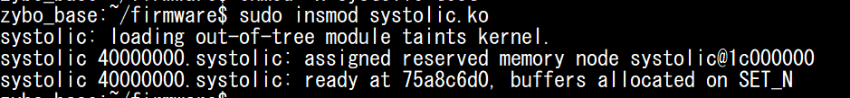

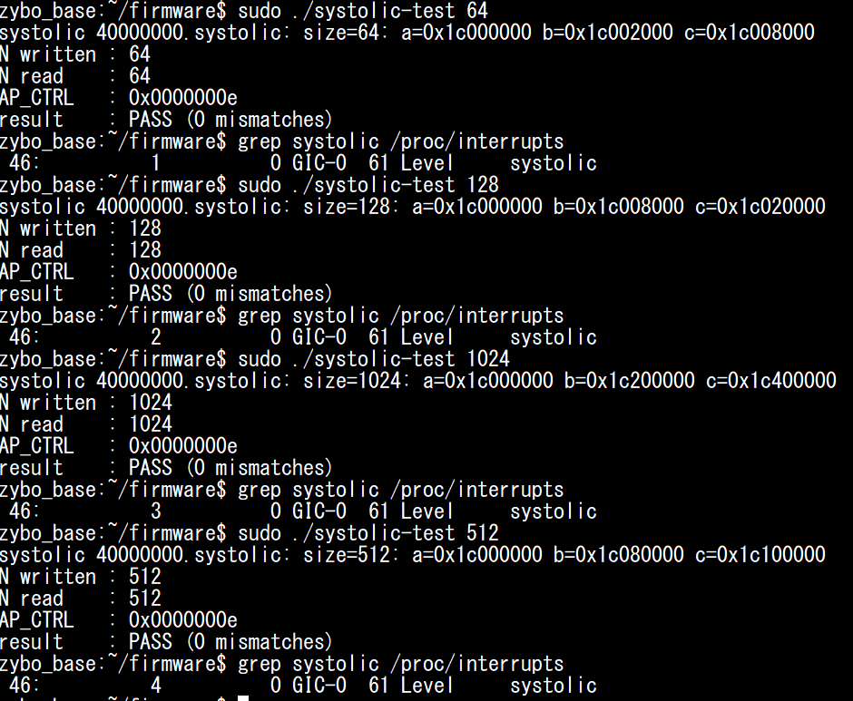

Here you can see that when i check the interrupts occured for systolic driver after runnig application, its incremented by once each time. 

## Summary {#summary}

* A platform driver is bound to a device tree node by its `compatible` string. Nothing else connects the two.
* `probe()` runs when that match happens. It maps the register space, sets up whatever the driver needs, and creates the node under `/dev/`.
* Anything allocated with a `devm_` helper in probe is released by the kernel automatically, which is why `remove()` has so little in it.
* A misc device is the short way to get a `/dev/` node: the framework shares major number 10 and hands out a minor.
* `file_operations` is the mapping between the calls userspace makes and the functions in the driver.
* `ioctl` configures the IP, `write` and `read` move the matrices. Register access is `readl` and `writel`, never a raw pointer.
* The IP reads and writes memory itself, so it needs physical addresses. `dma_alloc_coherent` returns both a virtual address for the driver and a bus address for the IP.
* DMA needs large contiguous memory, so the region is reserved in the device tree at boot. `kzalloc` cannot provide it.
* Polling the done bit holds the CPU for the whole matrix multiply. An interrupt with a wait queue lets the process sleep instead, and the ISR wakes it.
* Build it one step at a time and test on the board at each step. Each step here was a working driver.

## Glossary: the headers we included {#glossary}

Every header added across the five steps, and the one thing each was needed for.

**Driver side**

| Header | What we used it for |
| --- | --- |
| `<linux/module.h>` | module macros: `MODULE_LICENSE`, `MODULE_AUTHOR`, and what makes the file a loadable module. |
| `<linux/init.h>` | `module_init` and `module_exit`, which tell the kernel which functions to call on insmod and rmmod. |
| `<linux/kernel.h>` | assorted kernel helpers and the printing macros. |
| `<linux/of.h>` | device tree access, including `of_device_id` and the `compatible` matching. |
| `<linux/miscdevice.h>` | `struct miscdevice`, `misc_register` and `misc_deregister`, which give us the `/dev/` node. |
| `<linux/platform_device.h>` | `struct platform_driver`, `probe` and `remove`, and `platform_get_irq`. |
| `<linux/fs.h>` | `struct file_operations`, the table mapping userspace calls onto driver functions. |
| `<linux/io.h>` | `readl` and `writel`, and `devm_platform_ioremap_resource` for mapping the registers. |
| `<linux/iopoll.h>` | `readl_poll_timeout`, the polling loop used before we moved to interrupts. |
| `<linux/uaccess.h>` | `get_user`, `put_user`, `copy_from_user` and `copy_to_user` for crossing the userspace boundary. |
| `<linux/of_reserved_mem.h>` | `of_reserved_mem_device_init`, which attaches the reserved region from the device tree to the device. |
| `<linux/dma-mapping.h>` | `dma_alloc_coherent` and `dma_free_coherent`, which allocate memory the IP can reach. |
| `<linux/mutex.h>` | the mutex that stops two processes starting a transfer at the same time. |
| `<linux/interrupt.h>` | `devm_request_irq`, `irqreturn_t` and the ISR plumbing. |

**Userspace application**

| Header | What we used it for |
| --- | --- |
| `<stdio.h>` | userspace: `printf` for the test output. |
| `<stdlib.h>` | userspace: `malloc`, `free` and `atoi` for the matrix buffers and the size argument. |
| `<stdint.h>` | userspace: the fixed width types the IP's data is expressed in. |
| `<fcntl.h>` | userspace: `open` and its flags. |
| `<unistd.h>` | userspace: `read`, `write` and `close`. |
| `<sys/ioctl.h>` | userspace: the `ioctl` call itself. |

## References {#references}

* [Linux Device Drivers, 3rd edition (LDD3)](https://lwn.net/Kernel/LDD3/)
* [Driver implementer's API guide](https://docs.kernel.org/driver-api/index.html)
* [Misc devices](https://docs.kernel.org/driver-api/misc_devices.html)
* [Platform devices and drivers](https://docs.kernel.org/driver-api/driver-model/platform.html)
* [Device tree usage model in drivers](https://docs.kernel.org/devicetree/usage-model.html)
* [DMA API](https://docs.kernel.org/core-api/dma-api.html)
* [Reserved memory bindings](https://docs.kernel.org/devicetree/bindings/reserved-memory/reserved-memory.html)
* [Vitis HLS: AXI4-Lite and m_axi interfaces](https://docs.amd.com/r/en-US/ug1399-vitis-hls)
* [Zynq-7000 TRM (PL to PS interrupts)](https://docs.amd.com/r/en-US/ug585-zynq-7000-SoC-TRM)

---

**Series:** [Part 1](https://rafae1130.github.io/posts/embedded_linux/embedded-linux-zynq-soc-part-1.html) &middot; [Part 2: Device Tree](https://rafae1130.github.io/posts/embedded_linux/embedded-linux-zynq-soc-part-2.html) &middot; [Part 3: Device Tree Overlay and UIO](https://rafae1130.github.io/posts/embedded_linux/embedded-linux-zynq-soc-part-3.html) &middot; [Part 4: Writing a Linux Platform Driver](https://rafae1130.github.io/posts/embedded_linux/embedded-linux-zynq-soc-part-4.html) &middot; Part 5

<!-- post-nav -->

  <a class="nav-prev" href="https://rafae1130.github.io/posts/embedded_linux/embedded-linux-zynq-soc-part-4.html">&larr; Previous</a>
  <a class="nav-home" href="https://rafae1130.github.io/">Home</a>

<!-- /post-nav -->
