# Fractions in FPGA

## Table of contents

- [Introduction](#sec-intro)
- [1. Fixed Point vs Floating Point](#sec-1)
  - [1.1 Floating Point Scaling](#sec-1-1)
  - [1.2 Fixed Point Scaling](#sec-1-2)
  - [1.3 How Fractions Are Converted to Fixed Point and Floating Point](#sec-1-3)
- [2. Why Use Fixed Point in FPGAs?](#sec-2)
  - [2.1 Arithmetic Difference Between Floating and Fixed Point](#sec-2-1)
  - [2.2 Resource Usage](#sec-2-2)
- [3. Practical Example](#sec-3)
  - [3.1 The IIR Filter](#sec-3-1)
  - [3.2 MATLAB Flow](#sec-3-2)
  - [3.3 RTL Flow](#sec-3-3)
    - [Why This Happens](#sec-why)
    - [Proper Truncation](#sec-truncation)
- [4. When to Use Which?](#sec-4)
- [5. Summary](#sec-5)

## **Introduction** {#sec-intro}

Almost all of the systems or applications running on FPGAs deal with numbers. If those numbers are simple integers then it's all good. However, when we need fractions in our calculations, that's when the situation changes. To deal with fractions in digital domain, we have two techniques, Fixed point and Floating point. In this blog we'll see what's the pros and cons of these two, when to use which and why, demonstrating all these with a practical example following a whole design flow involving Matlab modeling, RTL simulation and running on board. 

## **1. Fixed Point vs Floating Point** {#sec-1}

We won't go into much details about the exact format as there are a lot of resources available for those, e.g. [Q number format](https://en.wikipedia.org/wiki/Q_%28number_format%29), [half precision floating point](https://en.wikipedia.org/wiki/Half-precision_floating-point_format) and MathWorks' [precision and range](https://www.mathworks.com/help/fixedpoint/ug/precision-and-range.html). I'll focus on the understanding and intuition of those formats. In terms of number representation, the floating point number can represent a very large range of numbers. 

Just as a refresher: Qm.n is a fixed point format with m bits before the binary point (the sign included) and n bits after it. E5M2 is an 8 bit floating point format with 5 exponent and 2 significand bits (plus a sign bit); FP16 has 5 and 10 (plus a sign bit).

| Format | Bits | Range |
|---|---|---|
| Fixed point, Q8.0 (integer) | 8 | −128 to 127 |
| Fixed point, Q1.7 | 8 | −1 to 0.992 |
| Floating point, FP8 (E5M2) | 8 | −57,344 to 57,344 |
| Fixed point, Q16.0 (integer) | 16 | −32,768 to 32,767 |
| Fixed point, Q15.1 | 16 | −16,384 to 16,383.5 |
| Fixed point, Q1.15 | 16 | −1 to 0.99997 |
| Floating point, FP16 (half precision) | 16 | −65,504 to 65,504 |
{: #range-table}

One odd thing you might notice is that the distinct values an 8 bit and 16 bit number can represent is 256 and 65536 values respectively. However, in the [table above](#range-table), an 8 bit floating point seems to be representing 114688 distinct values ( −57,344 to 57,344 ) and a 16 bit fp seems to be representing 131008 ( −65,504 to 65,504 ). How is this possible??? Can a floating point representation magically increase the number of possible distinct values??

That is not the case. 
One thing to keep in mind is that a n bit fixed point word and n bit floating point can represent same number of values i.e. at most 2^n. For example an 8 bit fixed point number and 8 floating point number both have 256 bit patterns. So if they can represent same number of distinct values, the question arises that how can floating point represent much larger range of numbers. The answer is that it doesn't represent all the values in between, and it takes jumps (gaps/steps/resolution) in between the values. 

| Format | Bits | Range | Gap between numbers |
|---|---|---|---|
| Fixed point, Q8.0 (integer) | 8 | −128 to 127 | 1, everywhere |
| Fixed point, Q1.7 | 8 | −1 to 0.992 | 0.0078, everywhere |
| Floating point, FP8 (E5M2) | 8 | −57,344 to 57,344 | 0.25 near 1, 8,192 near 57,344 |
| Fixed point, Q16.0 (integer) | 16 | −32,768 to 32,767 | 1, everywhere |
| Fixed point, Q15.1 | 16 | −16,384 to 16,383.5 | 0.5, everywhere |
| Fixed point, Q1.15 | 16 | −1 to 0.99997 | 0.00003, everywhere |
| Floating point, FP16 (half precision) | 16 | −65,504 to 65,504 | 0.001 near 1, 32 near 65,504 |

This is the same table as above with gaps column included. You might notice one detail, that the gaps (jumps/resolution between two consecutive number whatever you want to call it) in case of fixed point numbers are fixed, however in case of floating point, it's less at lower numbers and high at larger numbers. 
This is explained better in the figure below.

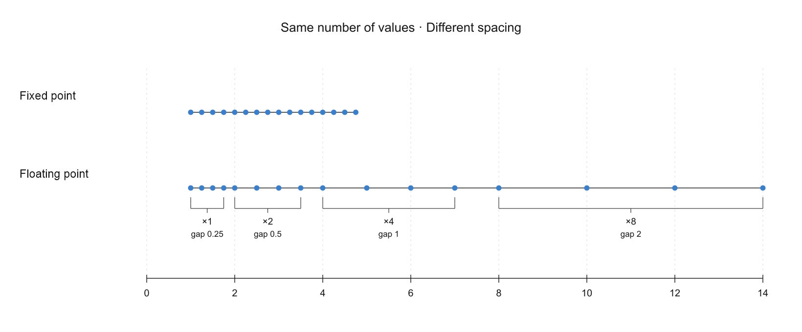

**Figure 1: Same number of values, different spacing: the fixed point gap stays the same, the floating point gap grows**

Why is that?? 

The answer is in the name of the formats, i.e. fixed and floating point. The jumps between two consecutive represented numbers in either format depends upon the location of its fractional point (or binary point). In case of fixed point, that fractional point is fixed, thus the jumps also remain fixed. However, as its name suggests, in floating point, the fractional point is floating, i.e. can move around. Therefore, the jumps also change. 

But how does that explain the gap/resolution getting bigger with larger numbers. 

### **1.1 Floating Point Scaling** {#sec-1-1}

Let's first look at this with plain integers. We take four numbers that are one apart, 4, 5, 6 and 7, and multiply each of them by 1, 2, 4 and 8. If you read each column of the table below from top to bottom, you can see what happens to the gap:

| Number | × 1 | × 2 | × 4 | × 8 |
|---|---|---|---|---|
| 4 | 4 | 8 | 16 | 32 |
| 5 | 5 | 10 | 20 | 40 |
| 6 | 6 | 12 | 24 | 48 |
| 7 | 7 | 14 | 28 | 56 |
| **Gap** | **1** | **2** | **4** | **8** |

The numbers we start with never change, only the multiplier does, and the gap grows with it. Now we can use the same concepts in floating point: 

| Significand | × 1 (2⁰) | × 2 (2¹) | × 4 (2²) | × 8 (2³) |
|---|---|---|---|---|
| 1.00₂ = 1 | 1 | 2 | 4 | 8 |
| 1.01₂ = 1.25 | 1.25 | 2.5 | 5 | 10 |
| 1.10₂ = 1.5 | 1.5 | 3 | 6 | 12 |
| 1.11₂ = 1.75 | 1.75 | 3.5 | 7 | 14 |
| **Gap** | **0.25** | **0.5** | **1** | **2** |

You can think of significand as base numbers similar to 4 5 6 7 in above example, now here we have 1 1.25 1.5 and 1.75. Now if we want to get different numbers from it, we multiply it with a scaling factor, 2^exponent. That's all an exponent does in floating point: it sets the multiplier value, e.g. an exponent of 3 means multiply by 2³ = 8 (the exponent can be negative too, which gives multipliers below 1, e.g. 2⁻¹ = 0.5, and so the small numbers). Hence similar to the integer column, when we multiply the same base values with increasing scaling factors, the gaps between the resulting values also increases. Basically, the same scaling factor is multiplied with the gap as well, and it increases accordingly. Multiplying by 2 moves the binary point one place to the right, for example 1.01₂ × 2² = 101₂ = 5, where the point moved two places. So the exponent is what makes the point float. You can notice this in the figure below:

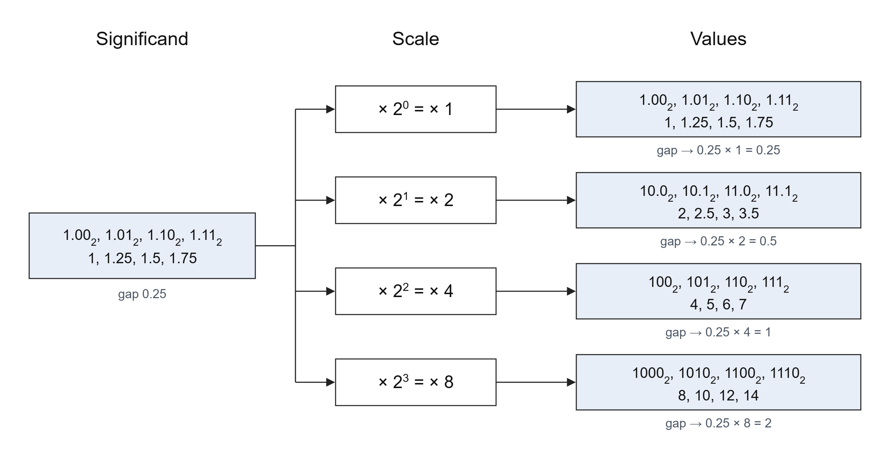

**Figure 2: One set of significands, scaled by 2^exponent: the gap grows with the scale**

A more comprehensive table is given below for a simplified floating point format, just for illustration, with 2 significand bits and 2 exponent bits to show scaling resolution concept (the significand always starts with 1, so that 1 isn't stored; the 2 stored bits are the ones after it):

| Significand bits | Significand | Value | Exponent bits | Scale | Gap to next |
|---|---|---|---|---|---|
| 00 | 1.00₂ = 1 | 1 | 00 | ×1 | 0.25 |
| 01 | 1.01₂ = 1.25 | 1.25 | 00 | ×1 | 0.25 |
| 10 | 1.10₂ = 1.5 | 1.5 | 00 | ×1 | 0.25 |
| 11 | 1.11₂ = 1.75 | 1.75 | 00 | ×1 | 0.25 |
| 00 | 1.00₂ = 1 | 2 | 01 | ×2 | 0.5 |
| 01 | 1.01₂ = 1.25 | 2.5 | 01 | ×2 | 0.5 |
| 10 | 1.10₂ = 1.5 | 3 | 01 | ×2 | 0.5 |
| 11 | 1.11₂ = 1.75 | 3.5 | 01 | ×2 | 0.5 |
| 00 | 1.00₂ = 1 | 4 | 10 | ×4 | 1 |
| 01 | 1.01₂ = 1.25 | 5 | 10 | ×4 | 1 |
| 10 | 1.10₂ = 1.5 | 6 | 10 | ×4 | 1 |
| 11 | 1.11₂ = 1.75 | 7 | 10 | ×4 | 1 |
| 00 | 1.00₂ = 1 | 8 | 11 | ×8 | 2 |
| 01 | 1.01₂ = 1.25 | 10 | 11 | ×8 | 2 |
| 10 | 1.10₂ = 1.5 | 12 | 11 | ×8 | 2 |
| 11 | 1.11₂ = 1.75 | 14 | 11 | ×8 | – |

The significand repeats the same four values for every exponent, only the scale changes. And the gap is 0.25 × scale, so it doubles with every step of the exponent: 0.25, 0.5, 1, 2. These 16 values are the floating point dots in Figure 1.

### **1.2 Fixed Point Scaling** {#sec-1-2}

 Fixed point uses the same idea, but unlike the floating point which can have different multiplier/scales, a fixed point's multiplier/scale is fixed at design time. For example, if we have an 8 bit number and we choose the format Q6.2 (6 bits before the binary point, the sign included, and 2 after it), the multiplier is 2⁻² = 0.25 for every number. To get the value, we just multiply the stored integer, i.e. the whole 8 bit word, by 0.25. For example, the word 00000101 is the integer 5, so its value is 5 × 0.25 = 1.25, and if we put the binary point in place it reads 000001.01. In the same way 4, 5, 6 and 7 give 1, 1.25, 1.5 and 1.75, which are the same values as the floating point significand. But the next integers use the same multiplier as well, so 8 gives 2 and 9 gives 2.25, and the gap stays 0.25 everywhere, over the whole range from −32 to 31.75:

| Stored integer | 4 | 5 | 6 | 7 | 8 | 9 | … | 19 |
|---|---|---|---|---|---|---|---|---|
| Value (× 0.25) | 1 | 1.25 | 1.5 | 1.75 | 2 | 2.25 | … | 4.75 |

So with fixed point, we have to choose the format ourselves: more fraction bits give us smaller steps but a smaller range, and fewer fraction bits give a bigger range but bigger steps.

> **Note:** Since we have control over the step size and that step size is fixed, we can put the resolution where our signal is, and for a signal with a known range this can reduce quantization noise in DSP and other relevant applications. More on this in [FPGA Quantization: Rounding, Dither and Saturation](fpga-dsp-quantization-error-reduction.md).

### **1.3 How Fractions Are Converted to Fixed Point and Floating Point** {#sec-1-3}

We'll see how fractions are converted to their corresponding fixed and floating point representation with an example below.

For fixed point, say Q2.14, we multiply the number by 2¹⁴ and store the result as an integer. For 1.75 that's 1.75 × 16384 = 28672, which in binary, with the binary point in place, is:

```
01.11000000000000
```

To get the value back we just divide by 2¹⁴ again: 28672 / 16384 = 1.75. If a number falls between two steps, like 0.1, it can't be stored exactly and it ends up on one of the steps next to it.

Here is the same 1.75 in different fixed point formats:

| Format | Calculation | Stored integer | In binary |
|---|---|---|---|
| Q6.2 | 1.75 × 4 | 7 | 00000111 |
| Q4.4 | 1.75 × 16 | 28 | 00011100 |
| Q2.6 | 1.75 × 64 | 112 | 01110000 |
| Q2.14 | 1.75 × 16384 | 28672 | 0111000000000000 |
| Q1.15 | 1.75 × 32768 | 57344 is too big for 16 bits, it wraps to −8192, i.e. −0.25 | 1110000000000000 |

Hence when converting our application to fixed point in Matlab, special care needs to be taken as a wrong format can result in wrong values and wrong results on hardware.

For floating point the conversion takes a few more steps, like bringing the number into the right form, the biased exponent, rounding and special values like infinity. Explaining these in detail is not the goal of this post, and there are already good explanations with examples, e.g. [IEEE 754](https://en.wikipedia.org/wiki/IEEE_754), the [single precision format](https://en.wikipedia.org/wiki/Single-precision_floating-point_format) and this [float converter](https://www.h-schmidt.net/FloatConverter/IEEE754.html), where you can type in a number and see its bits.

## **2. Why Use Fixed Point in FPGAs?** {#sec-2}

Mainly because of resource usage and precision. Fixed point arithmetic can be treated simply as normal arithmetic for the most part. However, floating point requires special hardware which in turn result in extra resource usage. So it's a trade off whether your design requires more range or more precision and more efficient resource usage.

### **2.1 Arithmetic Difference Between Floating and Fixed Point** {#sec-2-1}

So why does floating point need special hardware? A floating point number is stored as separate parts, a sign, a significand and an exponent, and its value is significand × 2^exponent. The hardware has to handle each part separately, so we can't just use a normal integer adder or multiplier on it.

Addition is a good example. We can only add two numbers when they have the same scale, i.e. the same exponent. It's like adding 3 m and 5 cm: we can't just do 3 + 5, we first have to write both in the same unit, 3 m + 0.05 m = 3.05 m. In the figure below, 6 is 1.10 × 2² and 2 is 1.00 × 2¹, so if we add 1.10 + 1.00 directly, the result is wrong because the two numbers have different scales. So the hardware first compares the exponents, shifts the smaller number until both have the same exponent, adds them, and then shifts the result back and rounds it. All of these steps need extra logic: a subtractor, shifters and rounding logic. Multiplication is a bit simpler, we multiply the significands and add the exponents, but it still needs the shift back and the rounding.

In fixed point, all numbers have the same scale since the binary point is fixed at design time, so adding is just a normal integer addition.

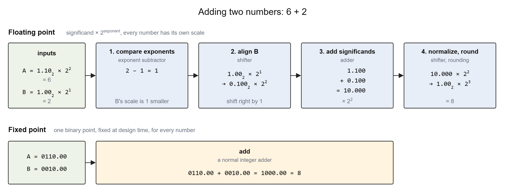

**Figure 3: Adding 6 + 2: four steps in floating point, one integer add in fixed point**

### **2.2 Resource Usage** {#sec-2-2}

Below is the resource usage for the practical example we'll do later, we create the project for both Floating point and fixed point, and we can see that floating point is using a lot more resources as compared to fixed point. We'll see in the example that we don't lose accuracy for it.

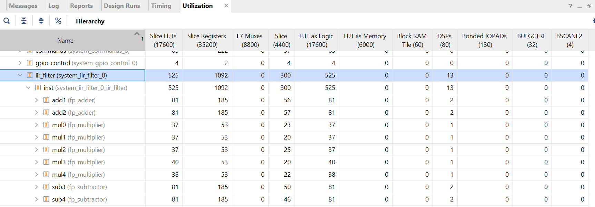

**Figure 4: FP16: 523 LUTs, 1122 registers, 13 DSPs**

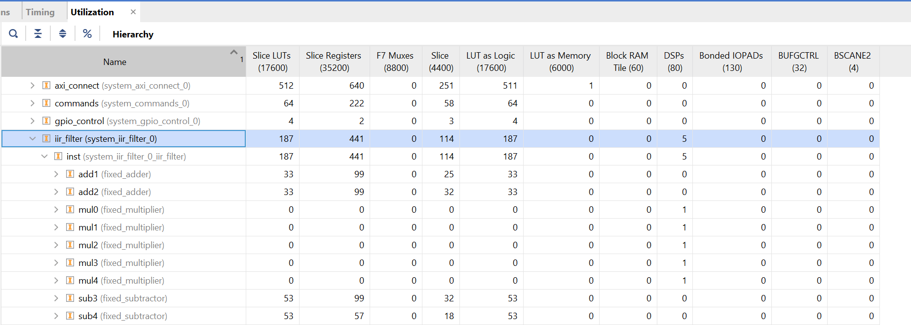

**Figure 5: Fixed point Q2.14: 332 LUTs, 635 registers, 5 DSPs**

Compared to FP16, the fixed point filter uses 37% fewer LUTs, 43% fewer registers and 62% fewer DSPs (5 instead of 13) for the same application.

## **3. Practical Example** {#sec-3}

Now we'll go through an actual flow of how to design a fixed point application for an FPGA. Usually when we design a system, we first model it in software using tools such as Matlab, to validate and ensure that the algorithm is working as intended. This is how we'll start here. 

### **3.1 The IIR Filter** {#sec-3-1}

We'll design an IIR filter to remove noise from our input signal. An IIR filter has a feedback loop. So if we have any error in our output i.e. quantization error, it will be fed back to the loop resulting in more and more errors. Therefore the selection of correct fixed point format is more important in case of IIR filters than in FIR filters, which have no feedback. 

The structure for our IIR filter is as below. It has both feed forward and feed back loop. The square boxes are delay lines, i.e. previous sample, and the triangles are filter coefficients which we'll generate in Matlab. 

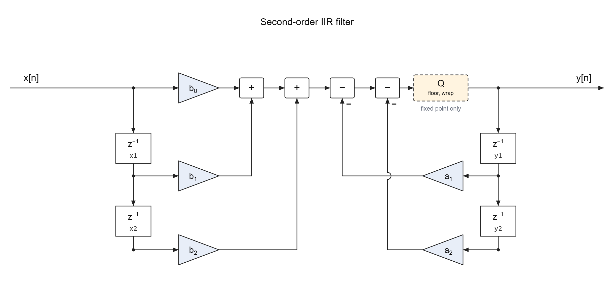

**Figure 6: Second-order IIR filter (direct form I)**
{: #fig-iir}

As discussed above, our current goal is to just verify if our filter design works for our application. So we start the modelling with floating point numbers. And once our design is proven to work, we'll move toward fixed point. 

### **3.2 MATLAB Flow** {#sec-3-2}

#### **Floating Point (Double)**


clear; clc;

% Input signal and low-pass filter
fs = 1000;
t = 0:1/fs:1-1/fs;
x = sin(2*pi*20*t) + 0.5*sin(2*pi*200*t);
[b, a] = butter(2, 50/(fs/2));

% Previous input and output samples
x1 = 0; x2 = 0;
y1 = 0; y2 = 0;
y = zeros(size(x));

% Same filter equation in every script
for n = 1:length(x)
    value = b(1)*x(n) + b(2)*x1 + b(3)*x2 ...
                      - a(2)*y1 - a(3)*y2;
    y(n) = value;

    x2 = x1; x1 = x(n);
    y2 = y1; y1 = y(n);
end

% Input and output plot
plotTitle = 'Floating point (double)';
figure('Color', 'w');
plot(t, x, 'Color', [0.65 0.65 0.65]);
hold on;
plot(t, y, 'Color', [0 0.35 0.65], 'LineWidth', 1.5);
title(plotTitle, 'Color', 'k');
xlabel('Time (s)', 'Color', 'k');
ylabel('Amplitude', 'Color', 'k');
legend('Input to filter', 'Filtered output', ...
       'Color', 'w', 'TextColor', 'k', 'Box', 'off');
xlim([0 0.2]); ylim([-1.6 1.6]);
grid on;
set(gca, 'Color', 'w', 'XColor', 'k', 'YColor', 'k', ...
    'FontName', 'Arial', 'GridAlpha', 0.15);


- `clear; clc`: clears the workspace and the command window.
- `fs`: sampling rate, 1000 samples per second.
- `t`: time of each sample, 0 to 0.999 s.
- `x`: input signal, a 20 Hz sine to keep plus a 200 Hz sine noise which we have to remove.
- `butter`: designs the second-order Butterworth low-pass filter, cutoff 50 Hz. 
- `b`: feed-forward coefficients b₀, b₁, b₂, the triangles in Figure 6.
- `a`: feedback coefficients; `a(1)` is 1, `a(2)` and `a(3)` are a₁ and a₂.
- `x1`, `x2`: the previous two input samples. See Figure 6.
- `y1`, `y2`: the previous two output samples. See Figure 6.
- `y`: output signal, one value per input sample.
- `n`: index of the current sample.
- `value`: filter output for the current sample.
- The rest are related to plotting

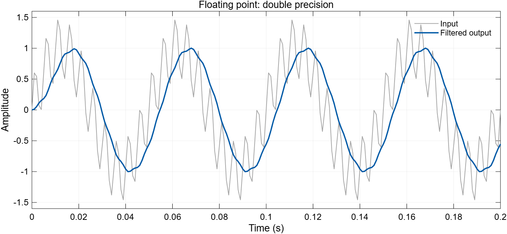

**Figure 7: MATLAB, double precision, output RMS: 0.698052**

We can see that the noise is removed from our signal after passing through the filter. Which proves that our design works. There are still some ripples if you look clearly but for our demonstration, this will do. Note that the Output RMS is 0.698052. Output RMS is the average size of the output signal; we'll compare every version against this value.

#### **Consequences of Choosing Wrong Fixed Format**

Now we can move toward porting our design over to fixed point. For this, we'll need to convert our input and filter coefficients to fixed point. We start with format Q1.15, since it has the most fraction bits, i.e. the smallest steps, which will reduce the quantization error.


clear; clc;

% Input signal and low-pass filter
fs = 1000;
t = 0:1/fs:1-1/fs;
x = sin(2*pi*20*t) + 0.5*sin(2*pi*200*t);
[b, a] = butter(2, 50/(fs/2));

% Fixed-point conversion, same as the RTL: floor and wrap.
W = 16;
F = 15;
T = numerictype(1, W, F);
M = fimath('RoundingMethod', 'Floor', 'OverflowAction', 'Wrap');
x = fi(x, T, M);
b = fi(b, T, M);
a = fi(a, T, M);

% Previous input and output samples
x1 = 0; x2 = 0;
y1 = 0; y2 = 0;
y = fi(zeros(size(x)), T, M);

% Same filter equation in every script
for n = 1:length(x)
    value = b(1)*x(n) + b(2)*x1 + b(3)*x2 ...
                      - a(2)*y1 - a(3)*y2;
    y(n) = fi(value, T, M);

    x2 = x1; x1 = x(n);
    y2 = y1; y1 = y(n);
end

% Input and output plot
plotTitle = sprintf('Fixed point Q%d.%d', W-F, F);
figure('Color', 'w');
plot(t, x, 'Color', [0.65 0.65 0.65]);
hold on;
plot(t, y, 'Color', [0 0.35 0.65], 'LineWidth', 1.5);
title(plotTitle, 'Color', 'k');
xlabel('Time (s)', 'Color', 'k');
ylabel('Amplitude', 'Color', 'k');
legend('Input to filter', 'Filtered output', ...
       'Color', 'w', 'TextColor', 'k', 'Box', 'off');
xlim([0 0.2]); ylim([-1.6 1.6]);
grid on;
set(gca, 'Color', 'w', 'XColor', 'k', 'YColor', 'k', ...
    'FontName', 'Arial', 'GridAlpha', 0.15);


- `W`: word length, 16 bits.
- `F`: number of fraction bits, 15, so the format is Q1.15 (range −1 to just under +1).
- `T`: the fixed-point type: signed, W bits, F fraction bits.
- `M`: truncation, like the RTL: drop the extra low bits (`Floor`) and the extra top bits (`Wrap`). Used for every conversion: the input, the coefficients and each output.
- `fi`: converts a value to type `T`, using `M`.
- `x = fi(x, T, M)`: the input in Q1.15; values beyond ±1 wrap around to the other sign.
- `b = fi(b, T, M)`: the feed-forward coefficients in Q1.15.
- `a = fi(a, T, M)`: the feedback coefficients in Q1.15; a₁ = −1.56 doesn't fit and wraps around to +0.439. `a(1)` = 1 wraps around to −1, but it is never used.
- `y`: the output, stored in Q1.15.
- `fi(value, T, M)`: even though value is a fixed point value, but after the multiplications and additions it becomes a 36 bit number, i.e two 16-bit Q1.15 multiplication = 32-bit Q2.30 result, and then 4 additions result in one bit per addition to 36 bits (Q6.30), so fi(value, T, M) truncates each output to Q1.15 before it is stored and fed back.

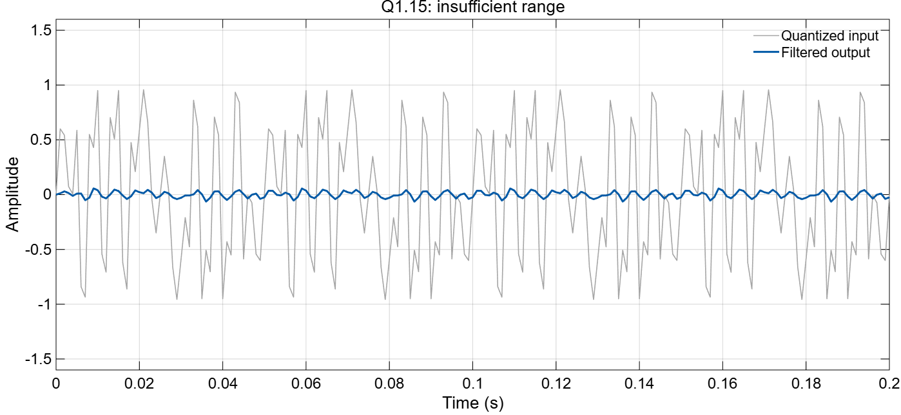

**Figure 8: MATLAB, Q1.15: the input wraps around, output RMS: 0.029698**

The input looks like noise because about a quarter of its samples (240 of 1000) are bigger than what Q1.15 can hold, so they wrap around to the other side, e.g. +1.160 is stored as −0.840 and +1.458 as −0.542 because:

```
1.458 in binary needs 17 bits:        0 1.011101010011001
Q1.15 keeps only the lowest 16 bits:    1.011101010011001
```

In Q1.15 the first bit is the sign bit and is worth −1, so the kept bits read −1 + 0.458 = −0.542. The integer 1 of 1.458 has become the sign bit.

In the output we see that magnitude is very less as compared to our floating point test above. The Output RMS is 0.029698 as compared to 0.698052 in case of floating point. This means something is wrong. 

The issue here is wrong selection of the fixed point format. 
Since we're working with signed numbers, Q1.15 has 1 sign bit and 15 fraction bits, so it can only hold values from −1 (1.000000000000000) to 0.99997(0.111111111111111). Our filter needs bigger numbers than that because: 

- The input goes up to 1.458, so it wraps around to −0.542.
- The coefficient a₁ is −1.561, so it wraps around to +0.439.

This is visible in the input waveform as well, which wraps around at its peaks.

#### **How to Select Correct Format**

To select the correct format, find the largest value that has to fit. Here it is a₁, 1.561. One integer bit gives a range of ±2, which is enough for 1.561. The input (peak 1.458) and the output (peak 1.002, see Figure 7) fit in it too. With 1 sign bit and 1 integer bit, 16 − 2 = 14 bits are left for the fraction, so the format is Q2.14: range −2 to 1.99994, step 0.00006.

We lose one bit of precision compared to Q1.15 (step 0.00003), but now everything fits.


clear; clc;

% Input signal and low-pass filter
fs = 1000;
t = 0:1/fs:1-1/fs;
x = sin(2*pi*20*t) + 0.5*sin(2*pi*200*t);
[b, a] = butter(2, 50/(fs/2));

% Fixed-point conversion, same as the RTL: floor and wrap.
W = 16;
F = 14;
T = numerictype(1, W, F);
M = fimath('RoundingMethod', 'Floor', 'OverflowAction', 'Wrap');
x = fi(x, T, M);
b = fi(b, T, M);
a = fi(a, T, M);

% Previous input and output samples
x1 = 0; x2 = 0;
y1 = 0; y2 = 0;
y = fi(zeros(size(x)), T, M);

% Same filter equation in every script
for n = 1:length(x)
    value = b(1)*x(n) + b(2)*x1 + b(3)*x2 ...
                      - a(2)*y1 - a(3)*y2;
    y(n) = fi(value, T, M);

    x2 = x1; x1 = x(n);
    y2 = y1; y1 = y(n);
end

% Input and output plot
plotTitle = sprintf('Fixed point Q%d.%d', W-F, F);
figure('Color', 'w');
plot(t, x, 'Color', [0.65 0.65 0.65]);
hold on;
plot(t, y, 'Color', [0 0.35 0.65], 'LineWidth', 1.5);
title(plotTitle, 'Color', 'k');
xlabel('Time (s)', 'Color', 'k');
ylabel('Amplitude', 'Color', 'k');
legend('Input to filter', 'Filtered output', ...
       'Color', 'w', 'TextColor', 'k', 'Box', 'off');
xlim([0 0.2]); ylim([-1.6 1.6]);
grid on;
set(gca, 'Color', 'w', 'XColor', 'k', 'YColor', 'k', ...
    'FontName', 'Arial', 'GridAlpha', 0.15);


- `F`: 14 fraction bits, so the format is Q2.14 (range −2 to just under +2), wide enough for the input peaks (±1.46) and a₁ (−1.56).

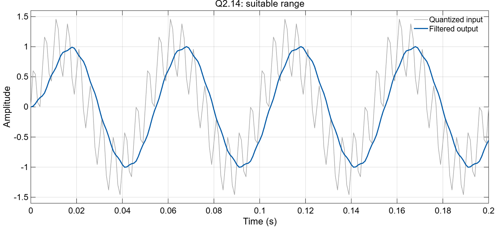

**Figure 9: MATLAB, Q2.14, output RMS: 0.698438**

Now we get Output RMS: 0.698438, close to the floating point result. Sample by sample, the error against the double result is only 0.0007 ([RMSE](https://en.wikipedia.org/wiki/Root_mean_square_deviation)).

### **3.3 RTL Flow** {#sec-3-3}

Now that we have tested our design and have our correct fixed point format, we can move toward RTL. 
The following figure represents a block level design for our RTL flow. Notice that it's the same as the [Matlab block diagram above](#fig-iir), just the delays are replaced with registers. 

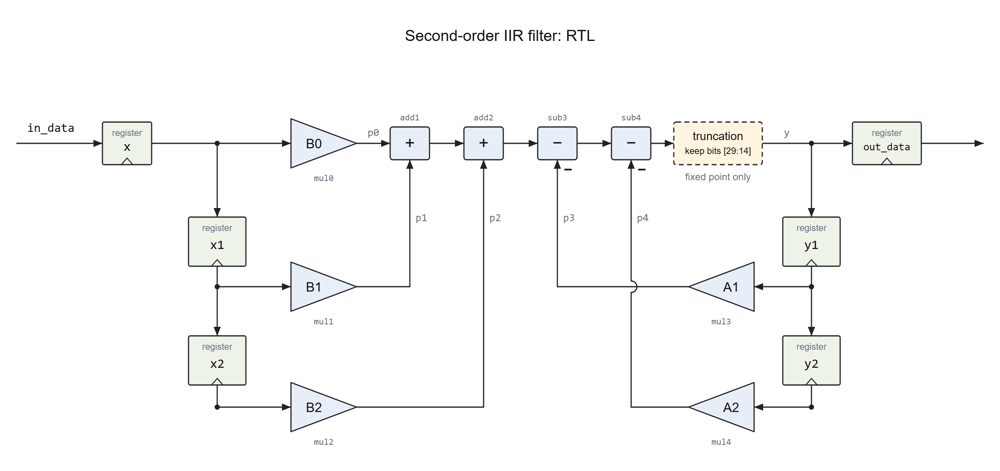

**Figure 10: The same filter in RTL, with the multiplier and adder IPs and the truncation**

#### **Q2.14 in RTL**


`timescale 1ns/1ps
// IIR low-pass filter, Q2.14 fixed point (16 bits, 14 fraction bits).
// Direct form I, same equation as the MATLAB script:
//   y = B0*x + B1*x1 + B2*x2 - A1*y1 - A2*y2
module iir_filter (
    input  wire        clk,
    input  wire        reset,
    input  wire        in_valid,
    output wire        in_ready,
    input  wire [15:0] in_data,
    output reg         out_valid,
    output reg  [15:0] out_data
);
    `include "coefficients.vh"             // B0, B1, B2, A1, A2 from MATLAB
    localparam MULT_LATENCY = 3;           // multiplier IP latency (create_projects.tcl)
    localparam ADD_LATENCY  = 8;           // adder/subtractor IP latency
    localparam LATENCY = MULT_LATENCY + 4*ADD_LATENCY;

    reg  signed [15:0] x, x1, x2, y1, y2;  // Q2.14
    wire signed [31:0] p0, p1, p2, p3, p4; // Q2.14 * Q2.14 = Q4.28
    wire signed [35:0] s1, s2, s3, sum;    // Q8.28: 1 extra bit per addition
    wire signed [15:0] y;                  // Q2.14
    reg  [LATENCY:0] busy;                 // where the sample is in the pipeline

    assign in_ready = !reset && busy == 0;

    // x, x1, x2, y1 and y2 do not change while busy, so no delay lines are needed.
    fixed_multiplier mul0 (.CLK(clk), .A(x),  .B(B0), .P(p0));
    fixed_multiplier mul1 (.CLK(clk), .A(x1), .B(B1), .P(p1));
    fixed_multiplier mul2 (.CLK(clk), .A(x2), .B(B2), .P(p2));
    fixed_multiplier mul3 (.CLK(clk), .A(y1), .B(A1), .P(p3));
    fixed_multiplier mul4 (.CLK(clk), .A(y2), .B(A2), .P(p4));

    // The sum, in the same order as the FP16 version. The products are
    // sign-extended to the full sum width, so nothing is dropped yet.
    wire signed [35:0] t0 = p0, t1 = p1, t2 = p2, t3 = p3, t4 = p4;
    fixed_adder      add1 (.CLK(clk), .A(t0), .B(t1), .S(s1));
    fixed_adder      add2 (.CLK(clk), .A(s1), .B(t2), .S(s2));
    fixed_subtractor sub3 (.CLK(clk), .A(s2), .B(t3), .S(s3));
    fixed_subtractor sub4 (.CLK(clk), .A(s3), .B(t4), .S(sum));

    // ---- Truncation wiring: Q8.28 sum -> Q2.14 --------------------------------
    assign y = sum;
    // ---------------------------------------------------------------------------

    always @(posedge clk) begin
        if (reset) begin
            busy <= 0;
            out_valid <= 0;
            out_data <= 0;
            x <= 0; x1 <= 0; x2 <= 0; y1 <= 0; y2 <= 0;
        end else begin
            busy <= {busy[LATENCY-1:0], in_valid && in_ready};
            out_valid <= busy[LATENCY];

            if (in_valid && in_ready)
                x <= in_data;

            if (busy[LATENCY]) begin       // y is ready
                out_data <= y;
                x2 <= x1; x1 <= x;
                y2 <= y1; y1 <= y;
            end
        end
    end
endmodule


We model the same system as in Matlab, and as we know we don't need any special hardware for fixed point, we can just use normal arithmetic. Here's how each MATLAB line maps to it:

- `W = 16; F = 14;` → `reg signed [15:0] x, x1, x2, y1, y2;` (line 19). 16 bit signed registers; the 14 fraction bits only exist in our heads, the hardware just sees integers.
- `b = fi(b, T, M); a = fi(a, T, M);` → `coefficients.vh` (line 14). The same Q2.14 coefficients, exported from MATLAB as `B0` to `A2`.
- `x = fi(x, T, M);` → `x <= in_data;` (line 57). The samples already arrive in Q2.14.
- `x1 = 0; x2 = 0; y1 = 0; y2 = 0;` → the reset (line 51).
- `b(1)*x(n)` to `a(3)*y2` → `mul0` to `mul4` (lines 28–32). One multiplier per term, 16 × 16 → 32 bit Q4.28, same as in MATLAB.
- the `+` and `−` in `value` → `add1`, `add2`, `sub3`, `sub4` (lines 37–40). A 36 bit Q8.28 `sum`, the same size as `value`.
- `y(n) = fi(value, T, M);` → `assign y = sum;` (line 43). Back to 16 bits: the 36 bit sum is connected straight to the 16 bit `y`. Verilog keeps the lowest 16 bits, `sum[15:0]`, and drops the top 20. The simulator compiles it with no error and no warning.
- `x2 = x1; x1 = x(n); y2 = y1; y1 = y(n);` → the same lines with `<=` (lines 61–62). The delays, z⁻¹ in the figure.
- `for n = 1:length(x)` → `in_valid`, `in_ready`, `out_valid` and `busy`. One sample at a time; this part only moves the samples through the pipeline and is the same in every version below.
- The plot scale here is ±2.05 instead of ±1.5, so the output fits.

##### **Simulation**

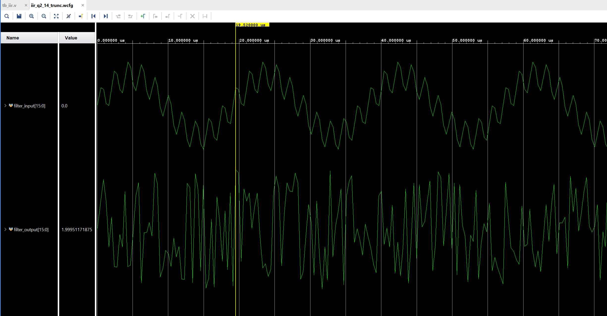

**Figure 11: Simulation of `assign y = sum;`, output RMS: 1.177154**

Why is this? We did everything correctly. Used the matlab generated coefficients, same fixed point format as tested in Matlab, then why still incorrect result. The reason is truncation. Remember y(n) = fi(value, T, M); in the matlab code, we discussed that this is needed to convert the 36 bit output of the filter back to 16 bits. But this function hides the detail of how the truncation is actually done. In the above RTL we're just truncating the MSBs and keeping the 16 LSBs. Before explaining why this causes problem, lets see what happens if we do the inverse, i.e. discard the LSBs and keep the 16 MSBs.

##### **What If We Keep the MSBs?**


`timescale 1ns/1ps
// IIR low-pass filter, Q2.14 fixed point (16 bits, 14 fraction bits).
// Direct form I, same equation as the MATLAB script:
//   y = B0*x + B1*x1 + B2*x2 - A1*y1 - A2*y2
module iir_filter (
    input  wire        clk,
    input  wire        reset,
    input  wire        in_valid,
    output wire        in_ready,
    input  wire [15:0] in_data,
    output reg         out_valid,
    output reg  [15:0] out_data
);
    `include "coefficients.vh"             // B0, B1, B2, A1, A2 from MATLAB
    localparam MULT_LATENCY = 3;           // multiplier IP latency (create_projects.tcl)
    localparam ADD_LATENCY  = 8;           // adder/subtractor IP latency
    localparam LATENCY = MULT_LATENCY + 4*ADD_LATENCY;

    reg  signed [15:0] x, x1, x2, y1, y2;  // Q2.14
    wire signed [31:0] p0, p1, p2, p3, p4; // Q2.14 * Q2.14 = Q4.28
    wire signed [35:0] s1, s2, s3, sum;    // Q8.28: 1 extra bit per addition
    wire signed [15:0] y;                  // Q2.14
    reg  [LATENCY:0] busy;                 // where the sample is in the pipeline

    assign in_ready = !reset && busy == 0;

    // x, x1, x2, y1 and y2 do not change while busy, so no delay lines are needed.
    fixed_multiplier mul0 (.CLK(clk), .A(x),  .B(B0), .P(p0));
    fixed_multiplier mul1 (.CLK(clk), .A(x1), .B(B1), .P(p1));
    fixed_multiplier mul2 (.CLK(clk), .A(x2), .B(B2), .P(p2));
    fixed_multiplier mul3 (.CLK(clk), .A(y1), .B(A1), .P(p3));
    fixed_multiplier mul4 (.CLK(clk), .A(y2), .B(A2), .P(p4));

    // The sum, in the same order as the FP16 version. The products are
    // sign-extended to the full sum width, so nothing is dropped yet.
    wire signed [35:0] t0 = p0, t1 = p1, t2 = p2, t3 = p3, t4 = p4;
    fixed_adder      add1 (.CLK(clk), .A(t0), .B(t1), .S(s1));
    fixed_adder      add2 (.CLK(clk), .A(s1), .B(t2), .S(s2));
    fixed_subtractor sub3 (.CLK(clk), .A(s2), .B(t3), .S(s3));
    fixed_subtractor sub4 (.CLK(clk), .A(s3), .B(t4), .S(sum));

    // ---- Truncation wiring: Q8.28 sum -> Q2.14 --------------------------------
    assign y = sum[35:20];
    // ---------------------------------------------------------------------------

    always @(posedge clk) begin
        if (reset) begin
            busy <= 0;
            out_valid <= 0;
            out_data <= 0;
            x <= 0; x1 <= 0; x2 <= 0; y1 <= 0; y2 <= 0;
        end else begin
            busy <= {busy[LATENCY-1:0], in_valid && in_ready};
            out_valid <= busy[LATENCY];

            if (in_valid && in_ready)
                x <= in_data;

            if (busy[LATENCY]) begin       // y is ready
                out_data <= y;
                x2 <= x1; x1 <= x;
                y2 <= y1; y1 <= y;
            end
        end
    end
endmodule


- The only change from the previous version: `sum[35:20]` instead of `sum`.
- At this scale the output is a flat line.

##### **Simulation**

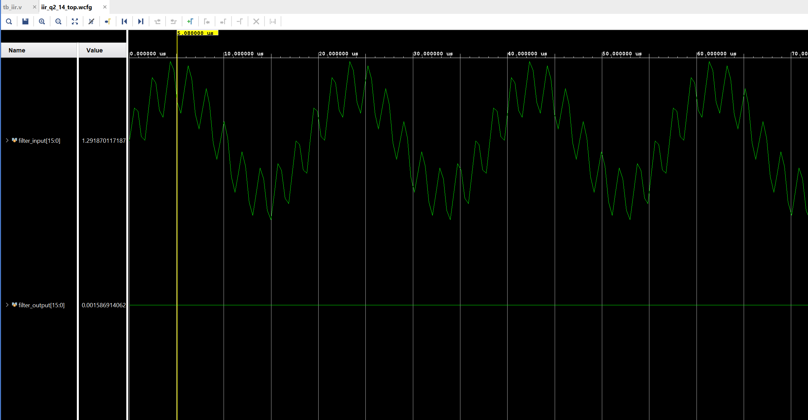

**Figure 12: Simulation of `assign y = sum[35:20];`, output RMS: 0.000940**

The output isn't any better. 

##### **Why This Happens** {#sec-why}

This is the main thing that needs to be handled differently from normal integer arithmetic in FPGAs. 

The sum coming out of the adders is 36 bits, Q8.28: the sign and 7 integer bits, then 28 fraction bits. So its binary point sits between bit 28 and bit 27. Our output `y` is Q2.14, so the 16 bits we keep have to sit around that same binary point: 2 bits above it (the sign and the integer bit) and 14 below it.

Let's take one real sum from our filter, sample 68, the output peak where the cursor is in Figure 15. Its value is 1.0019834, and in bits:

```
             integer bits             fraction bits
bit:   35 34 33 32 31 30 29 28 . 27 .......... 14   13 ........... 0
sum:    0  0  0  0  0  0  0  1 . 00000000100000     01111110111100
```

Now let's see what the two wirings give for this same sum:

| Wiring | Bits kept | The 16 bits | Read as Q2.14 |
|---|---|---|---|
| `assign y = sum;` | [15:0] | 0001 1111 1011 1100 | 0.495850 |
| `assign y = sum[35:20];` | [35:20] | 0000 0001 0000 0000 | 0.015625 |

- `sum[15:0]`: these are the lowest 16 fraction bits of the sum. In the sum they are worth only 0.00003, but when we read them as Q2.14 they become 0.4958. The integer part (the 1 before the binary point) is dropped, so the result is completely wrong.
- `sum[35:20]`: here the 1 is kept, but only 8 fraction bits come with it (bits 27 to 20). Since `y` is still read as Q2.14, i.e. with 14 fraction bits, the binary point is 6 bits off and the value is 2⁶ = 64 times too small: 0.0156 instead of 1.0019.

And since `y` is fed back into the filter as `y1` and `y2`, this error is also used in the next two samples, and from there it goes around the loop. That's why the first output is just noise and the second one is almost zero.

#### **Proper Truncation** {#sec-truncation}

So how do we truncate properly? First we need to know where the binary point is in the sum, and then we keep the bits around it that fit our output format. For an output in Qm.n, that means m bits before the point (sign included) and n bits after it. In our case the output is Q2.14, so m = 2 and n = 14.

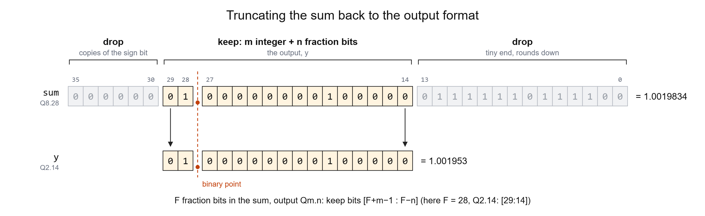

**Figure 13: Truncating the sum: keep the bits around the binary point**

To find the binary point, remember that when we multiply two fixed point numbers, their fraction bits add up, same as with decimals, e.g. 0.5 × 0.25 = 0.125 has 1 + 2 = 3 digits after the point. Adding doesn't move the point. In our case Q2.14 × Q2.14 gives 14 + 14 = 28 fraction bits, so bits 27 to 0 of the sum are the fraction.

After the point, we keep only the n bits we need and drop the rest. The dropped bits are very small, so dropping them just rounds the value down by less than one step. In our case we keep bits 27 to 14 and drop bits 13 to 0, which were worth only 0.00003, less than one Q2.14 step (0.00006).

Before the point, we keep m bits and drop the ones above them. This is only safe if the value fits in Qm.n, because then the dropped bits are just copies of the sign bit (all 0s or all 1s) and we don't lose anything. That's why we selected the format in MATLAB first. In our case we keep bits 29 and 28 and drop bits 35 to 30, which are all 0 here. Note that MATLAB only checked this for the input we tested. Our output peaks at 1.002, well inside ±2, but a different input could still overflow.

So in general, if the sum has F fraction bits and the output is Qm.n, we keep bits [F+m−1 : F−n]. For us that's F = 28, m = 2 and n = 14, i.e. bits [29:14], which is `assign y = sum[29:14];`.

#### **Q2.14 RTL with Correct Truncation**


`timescale 1ns/1ps
// IIR low-pass filter, Q2.14 fixed point (16 bits, 14 fraction bits).
// Direct form I, same equation as the MATLAB script:
//   y = B0*x + B1*x1 + B2*x2 - A1*y1 - A2*y2
module iir_filter (
    input  wire        clk,
    input  wire        reset,
    input  wire        in_valid,
    output wire        in_ready,
    input  wire [15:0] in_data,
    output reg         out_valid,
    output reg  [15:0] out_data
);
    `include "coefficients.vh"             // B0, B1, B2, A1, A2 from MATLAB
    localparam MULT_LATENCY = 3;           // multiplier IP latency (create_projects.tcl)
    localparam ADD_LATENCY  = 8;           // adder/subtractor IP latency
    localparam LATENCY = MULT_LATENCY + 4*ADD_LATENCY;

    reg  signed [15:0] x, x1, x2, y1, y2;  // Q2.14
    wire signed [31:0] p0, p1, p2, p3, p4; // Q2.14 * Q2.14 = Q4.28
    wire signed [35:0] s1, s2, s3, sum;    // Q8.28: 1 extra bit per addition
    wire signed [15:0] y;                  // Q2.14
    reg  [LATENCY:0] busy;                 // where the sample is in the pipeline

    assign in_ready = !reset && busy == 0;

    // x, x1, x2, y1 and y2 do not change while busy, so no delay lines are needed.
    fixed_multiplier mul0 (.CLK(clk), .A(x),  .B(B0), .P(p0));
    fixed_multiplier mul1 (.CLK(clk), .A(x1), .B(B1), .P(p1));
    fixed_multiplier mul2 (.CLK(clk), .A(x2), .B(B2), .P(p2));
    fixed_multiplier mul3 (.CLK(clk), .A(y1), .B(A1), .P(p3));
    fixed_multiplier mul4 (.CLK(clk), .A(y2), .B(A2), .P(p4));

    // The sum, in the same order as the FP16 version. The products are
    // sign-extended to the full sum width, so nothing is dropped yet.
    wire signed [35:0] t0 = p0, t1 = p1, t2 = p2, t3 = p3, t4 = p4;
    fixed_adder      add1 (.CLK(clk), .A(t0), .B(t1), .S(s1));
    fixed_adder      add2 (.CLK(clk), .A(s1), .B(t2), .S(s2));
    fixed_subtractor sub3 (.CLK(clk), .A(s2), .B(t3), .S(s3));
    fixed_subtractor sub4 (.CLK(clk), .A(s3), .B(t4), .S(sum));

    // ---- Truncation wiring: Q8.28 sum -> Q2.14 --------------------------------
    // The sum has 28 fraction bits and y needs 14. Keep bits [29:14]:
    //
    //   sum bits:  35 .. 30 | 29 ...... 14 | 13 ...... 0
    //              dropped  | y (16 bits)  | dropped
    //
    assign y = sum[29:14];
    // ---------------------------------------------------------------------------

    always @(posedge clk) begin
        if (reset) begin
            busy <= 0;
            out_valid <= 0;
            out_data <= 0;
            x <= 0; x1 <= 0; x2 <= 0; y1 <= 0; y2 <= 0;
        end else begin
            busy <= {busy[LATENCY-1:0], in_valid && in_ready};
            out_valid <= busy[LATENCY];

            if (in_valid && in_ready)
                x <= in_data;

            if (busy[LATENCY]) begin       // y is ready
                out_data <= y;
                x2 <= x1; x1 <= x;
                y2 <= y1; y1 <= y;
            end
        end
    end
endmodule


- The fix, and the only change from the wrong versions: `sum[29:14]` instead of `sum` or `sum[35:20]`.
- Truncation wiring: keeps bits [29:14] of the 36 bit Q8.28 sum. That drops the lowest 14 bits (the extra fraction bits) and the top 6 bits (the extra integer bits), leaving 16 bit Q2.14. This is what `fi(value, T, M)` does in MATLAB.
- No rounding and no saturation: dropping the low bits rounds down, and dropping the top bits is safe because with the correct format they are only copies of the sign bit.

<div style="overflow-x:auto">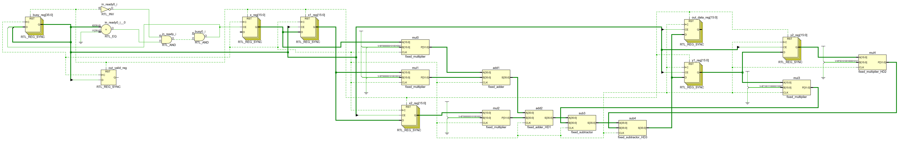</div>

**Figure 14: Elaborated schematic of the Q2.14 filter in Vivado**

##### **Simulation**

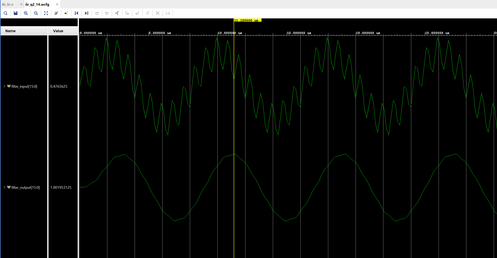

**Figure 15: Simulation of `assign y = sum[29:14];`, output RMS: 0.698438**

##### **On Board Testing**

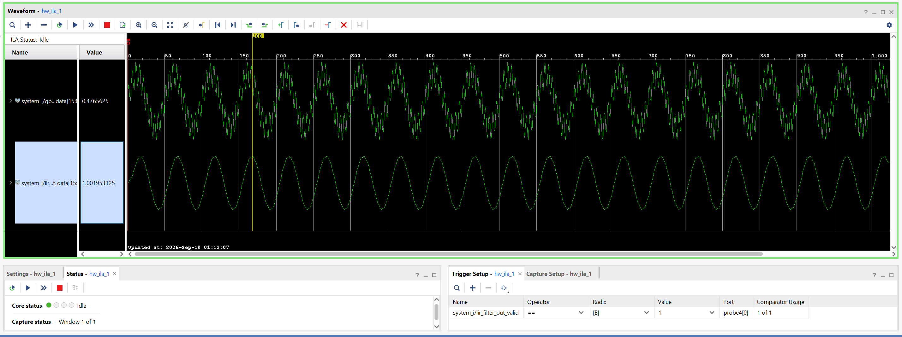

**Figure 16: ILA capture on the Zybo, output RMS: 0.698438**

#### **Floating Point (FP16)**

Now that the fixed point filter works, let's build the same filter in floating point, so we can compare the two. We use FP16, since it has the same 16 bits as Q2.14. The coefficients, the input and the equation are all the same, only the number format changes. This is the FP16 version of the same filter, the one whose resource usage we saw in section 2.2.


`timescale 1ns/1ps
// IIR low-pass filter, FP16 floating point (IEEE half precision).
// Direct form I, same equation as the MATLAB script:
//   y = B0*x + B1*x1 + B2*x2 - A1*y1 - A2*y2
module iir_filter (
    input  wire        clk,
    input  wire        reset,
    input  wire        in_valid,
    output wire        in_ready,
    input  wire [15:0] in_data,
    output reg         out_valid,
    output reg  [15:0] out_data
);
    `include "coefficients.vh"             // B0, B1, B2, A1, A2 from MATLAB
    localparam MULT_LATENCY = 3;           // multiplier IP latency (create_projects.tcl)
    localparam ADD_LATENCY  = 8;           // adder/subtractor IP latency
    localparam LATENCY = MULT_LATENCY + 4*ADD_LATENCY;

    reg  [15:0] x, x1, x2, y1, y2;         // FP16
    wire [15:0] p0, p1, p2, p3, p4;        // FP16 * FP16 = FP16 (rounded by the IP)
    wire [15:0] s1, s2, s3;                // running sum, FP16
    wire [15:0] y;                         // FP16
    reg  [LATENCY:0] busy;                 // where the sample is in the pipeline

    assign in_ready = !reset && busy == 0;

    // x, x1, x2, y1 and y2 do not change while busy, so no delay lines are needed.
    fp_multiplier mul0 (.aclk(clk), .s_axis_a_tvalid(1'b1), .s_axis_a_tdata(x),
                        .s_axis_b_tvalid(1'b1), .s_axis_b_tdata(B0), .m_axis_result_tdata(p0));
    fp_multiplier mul1 (.aclk(clk), .s_axis_a_tvalid(1'b1), .s_axis_a_tdata(x1),
                        .s_axis_b_tvalid(1'b1), .s_axis_b_tdata(B1), .m_axis_result_tdata(p1));
    fp_multiplier mul2 (.aclk(clk), .s_axis_a_tvalid(1'b1), .s_axis_a_tdata(x2),
                        .s_axis_b_tvalid(1'b1), .s_axis_b_tdata(B2), .m_axis_result_tdata(p2));
    fp_multiplier mul3 (.aclk(clk), .s_axis_a_tvalid(1'b1), .s_axis_a_tdata(y1),
                        .s_axis_b_tvalid(1'b1), .s_axis_b_tdata(A1), .m_axis_result_tdata(p3));
    fp_multiplier mul4 (.aclk(clk), .s_axis_a_tvalid(1'b1), .s_axis_a_tdata(y2),
                        .s_axis_b_tvalid(1'b1), .s_axis_b_tdata(A2), .m_axis_result_tdata(p4));

    // Every IP result is rounded to FP16, so the order of the sums matters. It is
    // the same order as the MATLAB FP16 reference:
    //   y = (((B0*x + B1*x1) + B2*x2) - A1*y1) - A2*y2
    fp_adder      add1 (.aclk(clk), .s_axis_a_tvalid(1'b1), .s_axis_a_tdata(p0),
                        .s_axis_b_tvalid(1'b1), .s_axis_b_tdata(p1), .m_axis_result_tdata(s1));
    fp_adder      add2 (.aclk(clk), .s_axis_a_tvalid(1'b1), .s_axis_a_tdata(s1),
                        .s_axis_b_tvalid(1'b1), .s_axis_b_tdata(p2), .m_axis_result_tdata(s2));
    fp_subtractor sub3 (.aclk(clk), .s_axis_a_tvalid(1'b1), .s_axis_a_tdata(s2),
                        .s_axis_b_tvalid(1'b1), .s_axis_b_tdata(p3), .m_axis_result_tdata(s3));
    fp_subtractor sub4 (.aclk(clk), .s_axis_a_tvalid(1'b1), .s_axis_a_tdata(s3),
                        .s_axis_b_tvalid(1'b1), .s_axis_b_tdata(p4), .m_axis_result_tdata(y));

    // ---- No truncation wiring: every FP16 IP result is already 16 bits ---------

    always @(posedge clk) begin
        if (reset) begin
            busy <= 0;
            out_valid <= 0;
            out_data <= 0;
            x <= 0; x1 <= 0; x2 <= 0; y1 <= 0; y2 <= 0;
        end else begin
            busy <= {busy[LATENCY-1:0], in_valid && in_ready};
            out_valid <= busy[LATENCY];

            if (in_valid && in_ready)
                x <= in_data;

            if (busy[LATENCY]) begin       // y is ready
                out_data <= y;
                x2 <= x1; x1 <= x;
                y2 <= y1; y1 <= y;
            end
        end
    end
endmodule


- `coefficients.vh`: the same coefficients, here as FP16 bit patterns.
- `x` to `y2`, `p0` to `p4`, `s1` to `s3`, `y`: all FP16, 16 bits everywhere. No `signed`, no wider sum and no sign extension.
- `fp_multiplier`: AMD Floating-Point IP set to multiply, 3 cycles, in place of the Multiplier IP.
- `fp_adder`, `fp_subtractor`: the same IP set to add and subtract, 8 cycles. Same number of IPs and same latency as the fixed point version.
- The adds are in the same order as in MATLAB, because every result is rounded to FP16 and the order changes the result.
- `s_axis_a_tvalid(1'b1)`: the IP inputs are always valid, `busy` does the timing instead.
- No truncation wiring: the IP rounds every result back to 16 bits itself.

##### **Simulation**

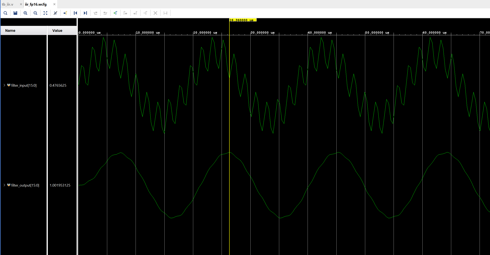

**Figure 17: FP16 simulation, output RMS: 0.696214**

##### **On Board Testing**

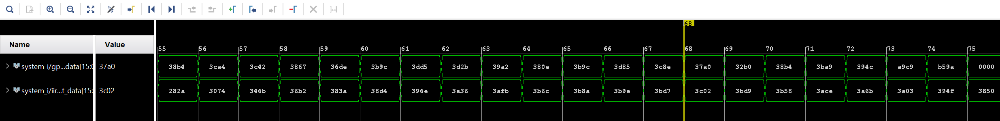

**Figure 18: FP16 ILA capture on the Zybo, shown in hex**

Vivado's ILA can show 32 and 64 bit floating point values, but not 16 bit (FP16) ones, so the capture is shown in hex. If we switch it to analog, it plots the raw bits as if they were integers, and the sign bit and the exponent turn the sine into a square wave. So below is the same capture, decoded to FP16 values and plotted:

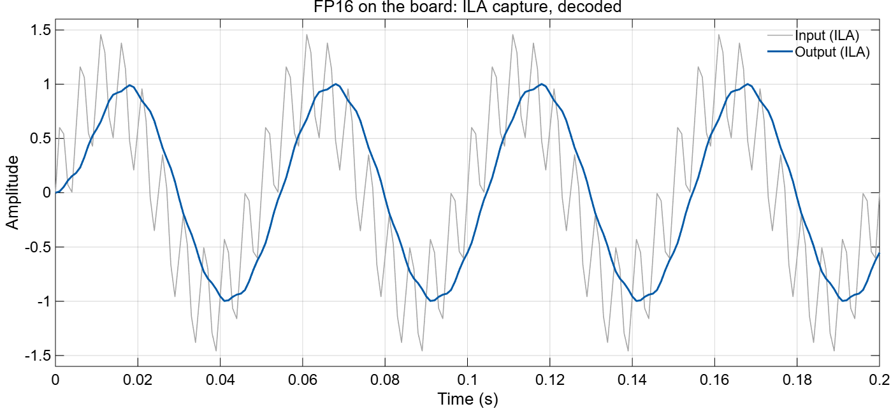

**Figure 19: FP16 ILA capture, decoded, output RMS: 0.696214**

Output RMS from MATLAB to the board:

| | MATLAB | Simulation | Board |
|---|---|---|---|
| Floating point | 0.698052 (double) | 0.696214 (FP16) | 0.696214 (FP16) |
| Fixed point, Q2.14 | 0.698438 | 0.698438 | 0.698438 |

RMS only tells us the size of the output, not if each sample is correct. So to compare the accuracy, we compare each output sample with the double precision output. The [RMSE](https://en.wikipedia.org/wiki/Root_mean_square_deviation) of this error is 0.000701 for Q2.14 and 0.002111 for FP16. For this application, fixed point was clearly the better choice, as it resulted in fewer resources and better performance.

## **4. When to Use Which?** {#sec-4}

So which one should we use? It mainly depends upon our application and the range of values it needs for proper functioning. With the same number of bits, floating point gives us more range, and fixed point gives us finer steps inside the range we choose.

If the values can get very large and very small, or we don't know the range in advance, floating point is the easier choice, since its gaps grow with the numbers and it can cover a huge range. That's why it's used in things like scientific simulations, 3D graphics and training neural networks.

If we know the range, like in our filter, fixed point makes more sense. Most DSP work falls here: filters, audio, ADC and DAC samples, motor control and image processing.

And on an FPGA it also uses a lot less resources, as we saw in section 2. So if you know your range, fixed point is usually the better choice.

## **5. Summary** {#sec-5}

- With the same number of bits, both formats have the same number of values. Floating point spreads them wider, with increasing gaps.
- Floating point needs extra hardware, so it uses more resources. Our fixed point filter used 37% fewer LUTs, 43% fewer registers and 62% fewer DSPs.
- With fixed point, we choose the format so the largest value fits. Q1.15 didn't work for our filter, Q2.14 did.
- We also have to truncate at the right bits: `sum[29:14]`. This is the main thing to take care of while working with fixed point numbers in RTL.
- With the right format and truncation, the fixed point filter matched MATLAB bit for bit, in simulation and on the board. For this test it was also closer to the double result than FP16 (RMSE 0.0007 vs 0.0021).
- Use floating point when you need range, and fixed point when you know your range.

<!-- post-nav -->
<div class="post-nav">
  <a class="nav-home" href="https://rafae1130.github.io/">Home</a>
</div>
<!-- /post-nav -->
