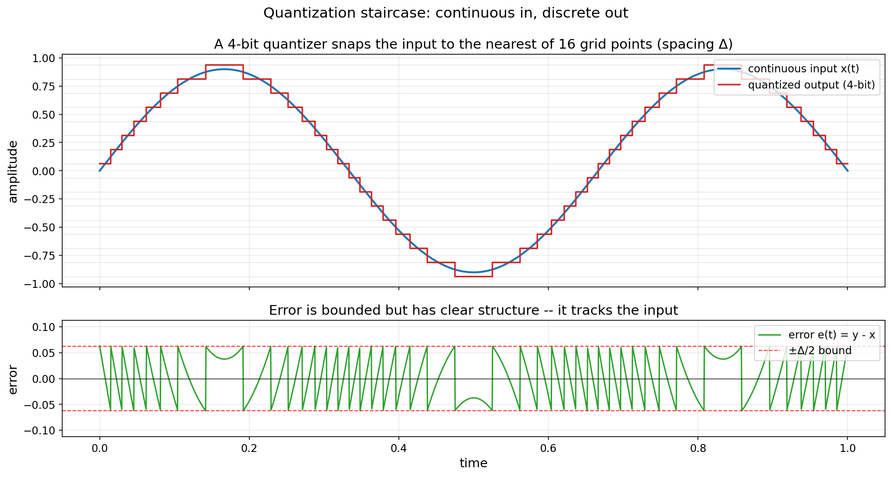
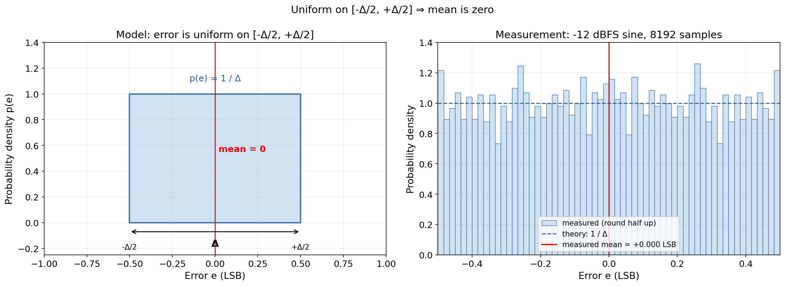
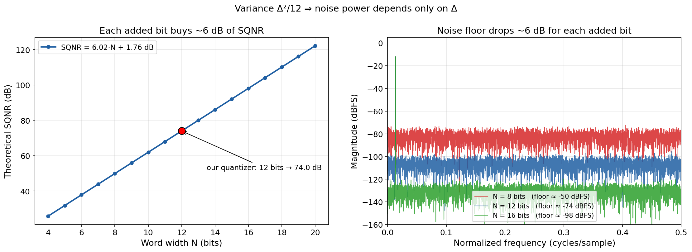
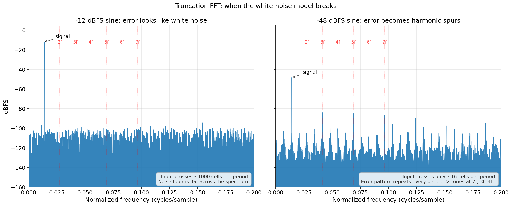
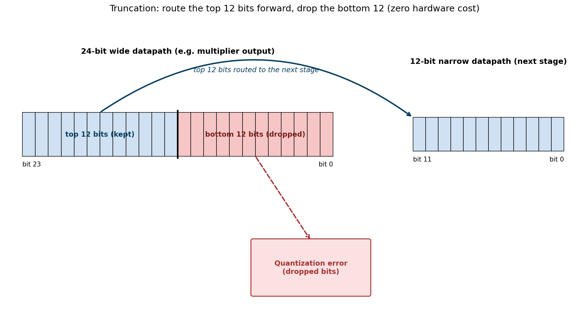
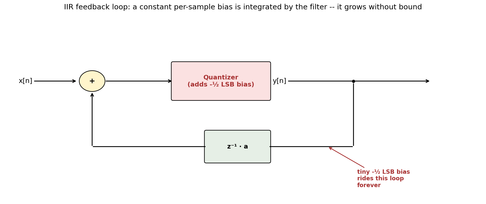
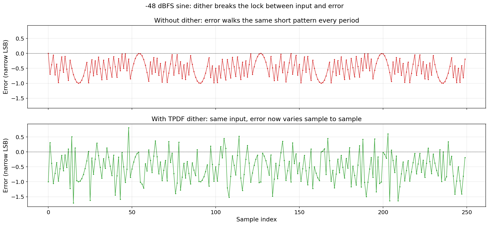
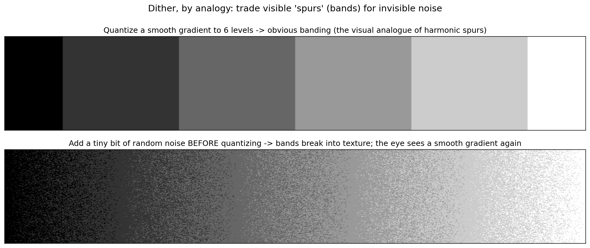
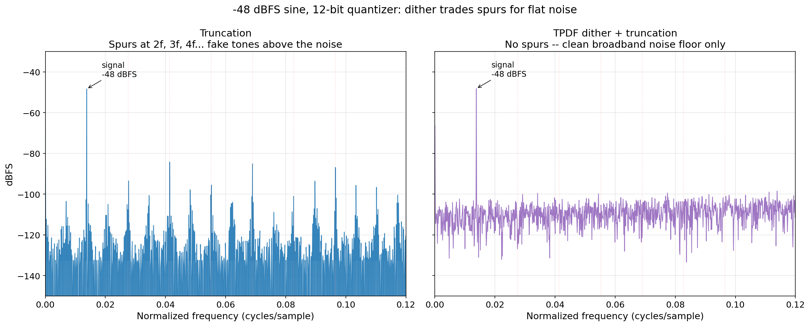
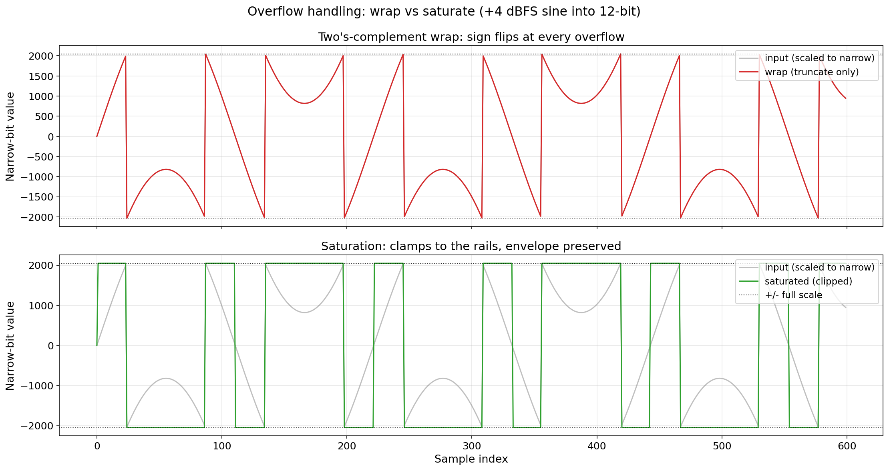

# FPGA DSP Quantization Error Reduction

# **1. Introduction**

Whenever you multiply or accumulate in an FPGA pipeline, the word width grows. A 16×16 multiply produces 32 bits; accumulating a hundred of those needs 39. But the next block, the memory, or the output port is usually only 16 bits wide. So, at some point the wide word has to be cut down to fit, and the bits you throw away in that cut are the quantization error of the stage.

This post walks through the standard techniques for reducing bit-width. We start with the cheapest one, find its drawback, reach for the next technique that fixes it, and repeat.

If an incorrect technique is used, your system doesn't just get noisy. It starts producing spurs that looks exactly like real signals.

# **2. Notation: LSB, Full Scale, dBFS**

Three units appear on every plot and spec sheet below.

**LSB.** The smallest step the quantizer can resolve. For a 12-bit signed output, 1 LSB = 1/4096 ≈ 0.000244 of full scale. Any change in the input smaller than that is invisible to the quantizer, it simply gets lost. "-½ LSB bias" means half of that step.

**Full scale (FS).** The largest magnitude the quantizer can represent without clipping. 12-bit signed → FS = 2048.

**dBFS.** A logarithmic scale. 0 dBFS represents the max value the quantizer can represent, i.e. full scale. Every -6 dB halves the amplitude. So -6 dBFS is half of FS, -12 dBFS is a quarter, -48 dBFS is 1/256 of FS, which on a 12-bit output (FS = 2048) is a sine peaking at only ±8. We use -12 dBFS as the healthy case and -48 dBFS as the case where quantization starts to misbehave. Appendix A has the full glossary for SQNR, SFDR, SINAD, and ENOB.

# **3. The Quantization Model**

Picture a ruler with only inch marks measuring a smooth curve. Every reading has to snap to the nearest available level. The information you lose is the gap between the true value and the nearest level.

A uniform quantizer does this digitally: input range split into equally spaced steps of size Δ, every input is snapped to the nearest one. The error per sample is bounded by ±Δ/2. That is all we can say with certainty.


**Figure 1:** A 4-bit quantizer. The red staircase is what comes out; the blue curve is what went in. The error panel below is bounded by ±Δ/2 but clearly tracks the input. It has structure, not randomness.

The ±Δ/2 bound only tells you how wrong any single reading can be. It says nothing about what the error does over time. Does it average to zero or drift? How loud is the total error compared to the signal? Where in the spectrum does it live? Those are the questions you need to answer to pick a word width, size filter headroom, or predict SFDR. ±Δ/2 alone gives none of them.

So we describe the error statistically instead. To do this, we make some assumptions: each sample's error is uniformly distributed on [-Δ/2, +Δ/2], independent from one sample to the next, and independent of the signal.

**Uniform on [-Δ/2, +Δ/2] ⇒ mean is zero.** A non-zero mean is a constant added to every sample. In a single pass FIR path, it just shifts the baseline i.e. adds an offset and is mostly harmless. Inside an IIR or any integrator i.e. feedback systems, the loop keeps adding that constant back into itself, so even a fraction of an LSB of bias accumulates without bound and eventually walks the output off the rails. This problem in feedback loops is avoided if the mean quantization is 0.

Another way to see it: if mean is 0, the error is just as likely to push the value up as down, so over many samples it cancels itself out instead of building into a constant offset.


**Figure 2:** The uniform error model. Left, the theory: error is equally likely anywhere in [-Δ/2, +Δ/2], so the probability density is a flat rectangle of height 1/Δ and the mean (the area-weighted center) is exactly zero. Right, 8192 measured errors from the round-half-up quantizer match the rectangle, with a measured mean of +0.000 LSB.

**Independent between samples ⇒ power spectrum is flat (white).** A flat spectrum spreads the total noise power uniformly across all frequency bins, so the noise at any single bin is tiny. If the spectrum is not flat, the energy piles up at specific frequencies and shows up as spurs, tones that look exactly like real signals. A weak signal sitting near a spur is now invisible, even though the total noise power has not changed. This is why SFDR depends on spectral shape, not just total power, and why the dither section later exists: to force the spectrum flat when determinism tries to create spurs.

Think of it like this: there's no repeating pattern, so nothing for the FFT to latch onto. The energy has nowhere to concentrate, so it spreads evenly. Noise spread across all frequencies is just a low background. The same noise stacked into one frequency looks exactly like a real signal there, which is much harder to deal with.

The third fact you need to size a datapath is the variance of that uniform error, which works out to Δ²/12. Noise power is set entirely by Δ. Combine that with the zero mean and the flat spectrum, and for a full-scale sine into an N-bit quantizer you get:

> **SQNR = 6.02 · N + 1.76   dB      (1)**

Each added bit buys about 6 dB. 12 bits give 74 dB, 16 bits give 98 dB. This is why adding bits is the only reliable way to lower quantization noise. Everything else just reshapes it, sometimes in ways that are worse.

The intuition: every extra bit you carry doubles your dynamic range. If 12 bits is not enough, 13 bits makes the noise floor twice as far below the signal, 14 bits makes it four times as far, and so on.


**Figure 3:** Δ²/12 in pictures. Left, theoretical SQNR vs word width: each added bit halves Δ, which quarters the noise power, which is +6 dB of SQNR. The 12-bit quantizer we use throughout this study lands at the predicted 74 dB. Right, the same effect in the spectrum: simulated noise floors of 8-, 12-, and 16-bit quantizers on the same -12 dBFS sine. The floor steps down by ~24 dB between each pair (4 bits × 6 dB).

Quantization error is deterministic. And deterministic error doesn't behave like noise. It behaves like signal. The approximation above only holds when the error actually looks random. Recall that quantization (we will define this formally in Section 4 as just dropping the bottom bits of a wider word) is a fixed function of the input meaning for same input it produces the same error, every time. And if the input is periodic, the error is periodic too. Whether it looks random in the FFT depends on how the input moves through the quantizer's steps. If the input is large, each new sample lands in a different cell with a different offset, and the errors from one sample to the next look scrambled.

However, the case is not the same for smaller amplitude signals. A -12 dBFS sine on our 12-bit quantizer has an amplitude of 512 LSBs, so in one period the input crosses about a thousand cells. Plenty of scrambling. A -48 dBFS sine has an amplitude of only 8 LSBs, so in one period it crosses about sixteen cells. The error now walks through the same short pattern every signal period, like a tiny lookup table replaying over and over. That pattern is periodic, so it appears as a spike in the FFT spectrum, similar to a real signal, not noise, and its energy piles up at harmonics of the signal frequency instead of spreading flat. The uniform-independent assumption no longer fits, and equation (1) stops being a useful prediction.


**Figure 4:** Truncated FFT of the same sine at two amplitudes. Left, -12 dBFS: the noise floor is flat across the spectrum and the white-noise model holds. Right, -48 dBFS: the noise is no longer flat. Discrete tones appear at 2f, 3f, 4f, the harmonics of the signal, because the truncation error is now a short repeating pattern locked to the signal period. Total noise power is similar on both sides; only its distribution changes.

The same thing happens inside a feedback loop. The quantizer error gets fed back into its own input, which correlates this sample's error with last sample's error, and independence between samples is gone. The whole chain of techniques below exists because of these two cases: low amplitudes and feedback loops, the exact places where the random-error story breaks down.

# **4. Truncation**

This is the cheapest way to drop bits: keep the top ones, discard the rest. In two's complement this is arithmetic floor. It has zero hardware cost as it's just routing.


**Figure 5:** Truncation is wire rerouting. The top 12 bits go to the next stage; the bottom 12 fall on the floor and become the quantization error.

```verilog
// 24-bit signed input, drop the bottom 12 bits, keep the top 12
wire signed [23:0] in;
wire signed [11:0] out;

assign out = in[23:12];   // arithmetic floor, just routing
```

Examples:
- 4.7 → 4.
- 4.1 → 4.
- -0.3 → -1.

The output is always at or below the input, never above.

**Drawback.** Truncation always rounds toward -∞, so it adds a constant -½ LSB to every sample. That's a DC bias. Harmless in a forward-pass path like FIR filters. Fatal in a feedback loop, where the bias rides the loop, and the error keeps accumulating.


**Figure 6:** Inside an IIR, the quantizer's tiny -½ LSB bias is fed back on every sample. The delay integrates it. A constant wins against any finite pole, because the loop keeps feeding the same offset back every cycle and nothing inside the filter cancels it out, so the output drifts.

The next technique fixes exactly this.

# **5. Round Half Up**

This adds half an LSB before truncating. Thus the bias drops from -½ LSB to near zero.

Examples:
- 4.4 → 4.
- 4.6 → 5.

Outputs now sit on both sides of the input, so the average error is zero.

> **y = ⌊ (x + Δ/2) / Δ ⌋      (2)**

```verilog
// 24-bit signed input, 12-bit output, add 1<<11 before truncating
wire signed [23:0] in;
wire signed [24:0] sum;   // one extra bit to absorb the add
wire signed [11:0] out;

assign sum = {in[23], in} + 25'sd2048;   // 2048 = 1 << 11
assign out = sum[23:12];
```

For any signal that doesn't land exactly on a midpoint (so, essentially every real sine), round-half-up and truncation differ by about 6 dB of SQNR and the full -½ LSB of bias. That's a free win.

**Drawback.** If the input does land on exact midpoints (slow ramps, decimation filters seeing carry patterns, DC inputs a half-step off), half-up always pushes them the same way. That reintroduces a small DC bias proportional to how often midpoints hit.

# **6. Convergent Rounding**

On a tie, round to the nearest even integer. Ties alternate up and down on repeated midpoint hits, so the long-run DC bias is exactly zero, not approximately. This is what we want inside IIR accumulators, ADC decimation, anywhere DC bias/offset matters.

Examples:
- 4.5 → 4.
- 5.5 → 6.
- 6.5 → 6.
- 7.5 → 8.

A pure stream of midpoint hits averages to zero exactly, because each tie goes the opposite direction of the previous one.

```verilog
// 24-bit signed in -> 12-bit out, round-to-nearest-even on ties
wire signed [23:0] in;
wire signed [11:0] trunc_v;   // top 12 bits of in
wire        [11:0] frac;      // bottom 12 bits (dropped)
wire               round_up;
wire signed [11:0] out;

assign trunc_v  = in[23:12];
assign frac     = in[11:0];
assign round_up = (frac >  12'd2048) ||                  // > midpoint
                  ((frac == 12'd2048) && trunc_v[0]);    // tie + odd
assign out      = trunc_v + round_up;
```

AMD DSP48E2/DSP58 slices implement this via the PATTERNDETECT flag, no extra LUT. Intel Stratix DSP blocks have the same feature in their rounding unit. So it's also free on target silicon.

Here is the catch with all three rounders so far. Rounding is similar to a fixed lookup table from input to error: for the same sample in, it outputs the same error out. If the input is a sine, the error repeats once per cycle, and a repeating error is not noise. It's a second waveform riding on the signal, and the FFT shows it as tones at multiples of the signal frequency.

At high amplitude you usually don't notice this because the noise power is spread through more frequency bins, which is why it slips through testing. The sine sweeps across thousands of quantizer steps, the error pattern looks jagged enough to smear across the whole spectrum, and we get away with calling it quantization noise. But when the amplitude is dropped, the scenario changes. The sine only touches a handful of steps. The error pattern collapses into a simple repeating staircase, and its harmonics are tall enough to poke out of the noise floor as visible spurs. Averaging longer also doesn't help, because the spur is fixed to the signal and shows up the same way in every period. If you've ever seen a spectrum with unexplained tones that don't move with the input, this can be the reason.

**Drawback.** DC bias can be solved through rounding, but spectral purity is not. Any rounding rule that depends only on the input cannot break this relation between input signal and output error. The fix has to inject something the rule cannot predict.

# **7. Dither**

It might sound counter intuitive, but this adds a small amount of random noise to the input before quantizing. Rounding tries to make each sample more accurate. Dither instead makes the error behave better over time and avoids it looking like actual signal. To understand why it works, recall what created the spurs in the first place. The rounding rule is a fixed function of the input, so a periodic input produces a periodic error, and the FFT shows that periodic error as tones at the harmonics of the signal. The error has structure because of the fixed structure in rounding schemes.

Dither breaks that structure. Random noise is introduced before rounding and by the time the input reaches the rounding stage, it has a tiny random number added to it, so the stage now sees signal + noise instead of signal alone. Whether a sample rounds up or down depends on where the noise pushed it that cycle, not just on the signal. The error is still bounded by ±Δ/2 per sample, but it is no longer a fixed function of the signal. The same input value produces different errors at different times.


**Figure 7:** -48 dBFS sine, truncation error vs sample index. Top: without dither, the error walks the same short pattern every signal period. That pattern is what the FFT sees as spurs. Bottom: with TPDF dither added before truncation, the same input produces an error that varies sample to sample. Same bound (±Δ/2), but no repeating pattern for the FFT to lock onto.

Total noise power goes up slightly because we deliberately added noise to the signal. But the noise that comes out is broadband and flat instead of concentrated at a few harmonic bins. A small increase in broadband noise is a great trade for getting rid of spurs, because a spur looks exactly like a real signal at that frequency. Anything downstream that does detection (FFT bin watch, CFAR radar, spectrum analyzer etc) cares about SFDR more than about total noise.

In practice: you trade a small, constant rise in background noise for the disappearance of fake tones. The total noise barely moves, but its shape changes from "a few tall spikes you can mistake for real signals" to "a flat carpet you can ignore".


**Figure 8:** The same idea on a grayscale gradient. Top: snap to 6 levels and you get visible bands, the visual analogue of harmonic spurs. Bottom: add a sliver of noise before the same 6-level snap and the bands break into texture; the eye reads it as a smooth gradient. Dither trades a structured artifact for broadband noise.

On the hardware side, an LFSR (Linear Feedback Shift Register) can be used to create the random noise which is just a shift register with an XOR feedback tap. It costs a few flip-flops and one XOR gate, runs at full clock speed, and produces a long pseudo-random bit stream. That is exactly what we need: cheap, fast, signal-independent random bits. The dither path is then trivial. Take the bottom 12 bits of the LFSR output as a signed random number, add it to the wide input word before slicing off the bottom, and let the truncation see signal + noise instead of signal alone. The same idea creates the texture you saw in the grayscale gradient figure: random bits added below the rounding boundary turn a hard staircase into a textured transition.

```verilog
// 32-bit maximal-length LFSR, taps at bits 32, 22, 2, 1.
// Feed 12 of its bits (as signed) into the quantizer input.
module lfsr32 (
    input             clk,
    input             rst_n,
    output reg [31:0] q
);
    wire fb = q[31] ^ q[21] ^ q[1] ^ q[0];

    always @(posedge clk or negedge rst_n) begin
        if (!rst_n) q <= 32'hACE1_BEEF;   // any non-zero seed
        else        q <= {q[30:0], fb};
    end
endmodule

// Using the LFSR: take 12 bits as signed dither, add to the
// 24-bit input, then truncate normally.
wire signed [11:0] dither = lfsr_q[11:0];     // RPDF on +/- 2048
wire signed [24:0] dithered = {in[23], in} + {{13{dither[11]}}, dither};
wire signed [11:0] out = dithered[23:12];
```


**Figure 9:** -48 dBFS sine, same data, same scale. Left: truncation, with a clearly visible spur at 2f, SFDR pinned at 35 dB. Right: one LFSR of TPDF dither, spur gone, SFDR past 47 dB. Total noise power barely moves; only its shape does.

**Drawback.** Dither fixes the small-signal spectrum but does nothing about the wrapping: a sample that's too large for the bitwidth. In two's complement, +max + 1 = -max, so overflow results in sign flips. One such flip inside an IIR can trigger a limit cycle and can result in design failure.

# **8. Saturation**

When a value goes past the maximum the word can hold, two's-complement arithmetic wraps it: +max + 1 becomes -max i.e. a sign flip. Saturation prevents this by clamping to the rails instead of wrapping.

```verilog
// 14-bit signed accumulator clipped to 12-bit signed output.
// 14-bit range is -8192..+8191; 12-bit range is -2048..+2047.
wire signed [13:0] in;
reg  signed [11:0] out;

always @(*) begin
    if      (in >   14'sd2047)  out =  12'sd2047;   // clamp high
    else if (in <  -14'sd2048)  out = -12'sd2048;   // clamp low
    else                        out =  in[11:0];    // in range
end
```

Clipping is non-linear and adds its own distortion when the signal hits the rails. But the output stays bounded.


**Figure 10:** +4 dBFS sine into a 12-bit datapath. Top: truncation wraps, sign flipping at every overflow. Bottom: saturation clamps, envelope preserved.

AMD DSP58 exposes OVERFLOW/UNDERFLOW flags; Intel Stratix V saturates inside its 64-bit accumulator at full clock speed. Use them by default on any signal-path accumulator.

**Drawback.** Saturation keeps the datapath stable at a single level of precision, but it doesn't expand the dynamic range. For an FFT or a wide filterbank where inputs vary over many orders of magnitude, a fixed word simply can't cover it all.

# **9. Block Floating Point and Microscaling**

Static scaling pre-attenuates the input so the worst case fits. Simple and overflow-free, but it throws away SNR for typical signals. Full floating point (FP32) gives about 1500 dB of dynamic range but costs far more logic. Block Floating Point is the compromise: a block of N samples shares one common exponent, with the mantissas normalized to the block peak.

The AMD FFT LogiCORE uses BFP internally. Each stage monitors for imminent overflow, shifts the array down by one bit when needed, and tracks the running exponent. Near-FP32 dynamic range on fixed-point DSP slices.

For AI inference, the current standard is Microscaling (MX): blocks of 32 elements share an 8-bit exponent, with 4-6 bit minifloats per element (MXFP4, MXFP6). AMD Small Floating Point research shows multipliers fitting in about 9.5 LUT6s at 600 MHz, with no DSP slice required. Intel Stratix 10 NX Tensor Blocks pack around 30 such MACs per DSP block per cycle.

# **10. Bit-True Vivado Comparison**

Five quantizers run in parallel on the same input inside one xsim run (Vivado 2024.2, 24-bit → 12-bit, sine on bin 113 of 8192 for coherent sampling). Tables and plots below are lifted directly from the simulator's CSV dump.

## **10.1 -12 dBFS Sine**

| Technique      | mean   | rms   | SQNR | SFDR | SINAD | ENOB  |
|----------------|--------|-------|------|------|-------|-------|
| Truncation     | -0.500 | 0.578 | 55.9 | 82.4 | 61.9  | 9.99  |
| Round half up  | +0.000 | 0.288 | 62.0 | 82.8 | 62.0  | 10.01 |
| Convergent     | +0.000 | 0.288 | 62.0 | 82.8 | 62.0  | 10.01 |
| dither + trunc | -0.500 | 0.710 | 54.2 | 82.9 | 57.1  | 9.20  |

All five land near the theoretical limit. Truncation shows its -½ LSB bias; half-up and convergent are indistinguishable because the sine almost never hits a midpoint exactly.

## **10.2 -48 dBFS Sine**

| Technique      | mean   | rms   | SQNR | SFDR | SINAD | ENOB |
|----------------|--------|-------|------|------|-------|------|
| Truncation     | -0.500 | 0.586 | 19.7 | 35.0 | 25.6  | 3.96 |
| Round half up  | +0.000 | 0.276 | 26.2 | 35.1 | 26.3  | 4.08 |
| Convergent     | +0.000 | 0.276 | 26.2 | 35.1 | 26.3  | 4.08 |
| dither + trunc | -0.500 | 0.712 | 18.0 | 47.5 | 20.9  | 3.19 |

SQNR is nearly flat across all five; SFDR spreads from 35 dB (spurs dominant) to 50 dB (spurs gone). This is the whole case for dither. Not to reduce noise, but to stop your system from lying to you with fake tones. Total noise barely changes, but its distribution does, and anything doing detection downstream (CFAR, FFT bin watch, audio) cares about spurs, not total noise. If you care about SFDR and you're not using dither, you're taking a risk.

# **11. When to Use What**

Almost every quantization bug you'll hit falls into two buckets:

1. **bias** (DC drift), fixed by rounding.
2. **structure** (spurs), fixed by dither.

Everything else on this list is about what to do when the signal does not fit the word, or the word does not fit the dynamic range.

Pick from the chain you just walked:

| Situation | Use | Why |
|-----------|-----|-----|
| Non-recursive path, DC doesn't matter | Truncation | Free. The -½ LSB bias is harmless if nothing integrates it. |
| General-purpose rounder | Round half up | One adder; ~6 dB better SQNR; near-zero bias for real signals. |
| IIR feedback, decimation, anything that feeds DC | Convergent rounding | Exactly zero bias. Free inside DSP48E2/DSP58 via PATTERNDETECT. |
| Low-amplitude signals where spurs hurt (audio, DDS, radar, ADC readout) | dither | Trades ~5 dB SQNR for ~15 dB SFDR. Signal-independent noise. |
| Anything that can overflow | Saturation | Wrap triggers limit cycles. Saturation just clips. Free in DSP58. |
| Wide dynamic range, parallel arithmetic (FFT, filterbanks) | Block floating point | Near-FP32 DR on fixed-point slices. Built into the AMD FFT LogiCORE. |
| Neural-network inference | Microscaling (MXFP4 / MXFP6) | Shared 8-bit exponent, 4-6 bit mantissa. AMD SFP fits in ~9.5 LUT6s; Intel NX packs ~30 MACs/cycle. |

Bit-width reduction is never free. Each technique on this list pays a different price (a DC bias, a tone, a clipped peak, an extra LFSR, a shared exponent), and the whole design exercise is choosing which price you can afford in your particular signal path. The chain in this post is the menu. Truncation is the cheapest and the noisiest. Convergent rounding fixes DC. Dither fixes spurs. Saturation fixes overflow. BFP and microscaling fix dynamic range. Pick the first one that survives your worst-case input and stop there.

# **Appendix A: Glossary**

Every metric used in the tables and plots, with a worked example from this study.

## **A.1 Time-Domain Error**

**Mean error.** DC component of the quantization error. Truncation: -½ LSB. Half-up and convergent: 0. Fatal inside an IIR.

**RMS error.** Root-mean-square of the per-sample error. Uniform quantizer: Δ/√12 ≈ 0.289 LSB. Truncation picks up the bias term and rises to ~0.577 LSB.

## **A.2 Frequency-Domain Error**

**FFT bin.** One frequency slot in an N-point DFT. Our test uses N = 8192 and places the sine on bin 113. Bin 113 is prime, so harmonics land on distinct bins (coherent sampling).

**SQNR.** Signal-to-Quantization-Noise Ratio. Ideal N-bit, full-scale sine: 6.02·N + 1.76 dB. 12 bits → ~74 dB.

**SFDR.** Spurious-Free Dynamic Range. dB from the signal bin to the next-tallest peak. A spur at -50 dBc looks like a real signal 50 dB weaker. The metric that matters for detection.

**SINAD.** Signal-to-Noise-and-Distortion. Signal power over everything else. Below SQNR once spurs show up.

**ENOB.** Effective Number of Bits = (SINAD - 1.76) / 6.02. SINAD = 62 dB → ENOB = 10. What datasheets print; what actually matters.

## **A.3 Dither Terms**

**RPDF.** Rectangular PDF: uniform random on ± ½ LSB, one LFSR. Removes mean error; noise still varies with signal.

**TPDF.** Triangular PDF: sum of two RPDFs, ± 1 LSB. Removes noise modulation too. Audio gold standard.

**LFSR.** Linear Feedback Shift Register. Cheap pseudo-random source in HDL. A 32-bit maximal-length LFSR repeats every 2³² − 1 cycles.

## **A.4 Filter / Overflow**

**Limit cycle.** Self-sustaining oscillation inside an IIR, set off by quantization non-linearity plus overflow wrap. Persists even at zero input.

**Two's-complement wrap.** +max + 1 = -max. Overflow flips sign. Saturation exists to prevent it.

**BFP.** Block Floating Point: N samples share one exponent, mantissas normalized to block peak. Used inside the AMD FFT LogiCORE.
