# Operand Packing

## Table of contents

- [Introduction](#sec-intro)
- [1. Unsigned Numbers](#sec-1)
  - [1.1 In Binary](#sec-1-1)
  - [1.2 Packing Rule](#sec-1-2)
- [2. Signed Numbers](#sec-2)
  - [2.1 Packing the Inputs](#sec-2-1)
  - [2.2 Reading the Products](#sec-2-2)
- [3. Packing on the DSP48E1](#sec-3)
  - [3.1 Example](#sec-3-1)
  - [3.2 The RTL](#sec-3-2)
  - [3.3 Simulation](#sec-3-3)
- [4. Summary](#sec-4)

## **Introduction** {#sec-intro}

If you are working with xilinx fpgas/socs then you might know it there are dedicated dsps blocks in the fabric for efficient arithmetic. They get more advanced with advanced fpga and socs but the concepts and techniques we'll be discussing today are relevant to all and arihtmetic in general.  

I have zybo 7010 board, which contains dsp48E1 blocks. So we'll be using those as in our explanation and examples.  

The dsp48e1 block is shown in the below diagram.  dont worry about all the other elements and just focus on the 25x18 multiplier in between. That will be our focus for today. Its function is similar, to multiply two inputs of sizes 25 bits and 18 bits. 

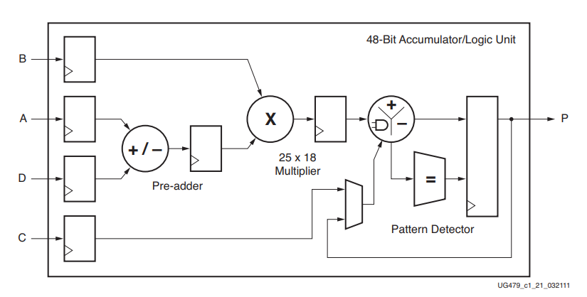

The main thing to focus here is the width of the multiplier. which is 25x18. Now imagine a scenario where we have to perform a 1000 multiplication in a system in parallel, but each of multplication is only 4x4. Now if i use a single dsp block for each of these multiplicaiton, I would need a 1000 dsp blocks. where most of the devices contain less than this. And even if these are available, its not really efficient. becuase out of 25x18, we only using 4x4 bits and wasting all the rest of available computational resources available to us.

| Board | Device | DSP slices | Price (USD, approx.) |
|---|---|---|---|
| Basys 3 | XC7A35T | 90 | 165 |
| PYNQ-Z2 | XC7Z020 | 220 | 129 |
| Ultra96-V2 | XCZU3EG | 360 | 290 |
| Zybo Z7-10 | XC7Z010 | 80 | 299 |
| Nexys A7-100T | XC7A100T | 240 | 383 |
| KC705 | XC7K325T | 840 | 2,995 |
| ZCU102 | XCZU9EG | 2,520 | 3,234 |
| Alveo U200 | XCU200 | 6,840 | 5,500–6,400 | 

So the question is, how can we use those unused bits? To move forward, we need to revise our decimal arithmetic concepts a bit to lay the groundwork. 

## **1. Unsigned Numbers** {#sec-1}

Say we have two multiplications, 2 × 3 and 4 × 3. Both have the same second operand, 3. Normally we'd need two multipliers for this. However, if we pack the two first operands, 2 and 4, into one number, with two zeros between them, and multiply that one packed number by 3 only once:

```
packed operand:     2 0 0 4      ← 2 and 4 packed in one number
single operand:   ×       3
                  ---------
result:             6 0 1 2

result split in two slots:   6 | 012
                             ↑    ↑
                         2 × 3   4 × 3
```

We did one multiplication, 2004 × 3 = 6012, and we can read both products from the result: the left slot holds 6, i.e. 2 × 3, and the right slot holds 012, i.e. 4 × 3 = 12.

Why does this work? Because 2004 is just 2 × 1000 + 4, so multiplying it by 3 multiplies both packed numbers by 3, and each product stays at the place where its number was:

This packing requires some rules to be followed so that the final results dont overwrite each other in the output. We'll discuss those in a a bit. Before we do that, here's anther example of multplication of 2 packed operands with 2 other packed operands:

Lets suppose we have four computations, i.e. 3 × 4, 3 × 1, 2 × 4 and 2 × 1. We can see that 3 and 2 are being multiplied with 4 and 1. Again, if we do these compuations each per 1 DSP, which is how it would normally map in a design, we'll need 4 DSPs. However, if we pack 3 and 2 into the first operand, and 4 and 1 into the second operand:

```
first packed operand:    2 00 03     ← 2 and 3
second packed operand:   ×  1 04     ← 1 and 4
                         ---------
result:                2 08 03 12

result split in slots:   2 | 08 | 03 | 12
                         ↑    ↑    ↑    ↑
                     2 × 1 2 × 4 3 × 1 3 × 4
```

One multiplication, 20003 × 104 = 2080312, and all four products are in the result. Writing both operands as place values shows where each product ends up:

```
3 × 4 = 12  →  position 0 + 0 = 0
3 × 1 =  3  →  position 0 + 2 = 2
2 × 4 =  8  →  position 4 + 0 = 4
2 × 1 =  2  →  position 4 + 2 = 6
```

### **1.1 In Binary** {#sec-1-1}

Now we'll use the same idea in binary, with values that fit in two bits.

The product of two n-bit numbers can require up to n + n bits, so multiplying two 4-bit numbers can require up to 8 bits.

```
first packed operand:           10 0000 0011     ← 2 and 3
second packed operand:   ×         0011 0001     ← 3 and 1
                         -------------------
result:                  0110 0010 1001 0011

result split in slots:   0110 | 0010 | 1001 | 0011
                          ↑      ↑      ↑      ↑
                        2 × 3  2 × 1  3 × 3  3 × 1
```

Every number in the first operand gets multiplied with every number in the second operand, and each product lands at the place value of its two numbers multiplied together.

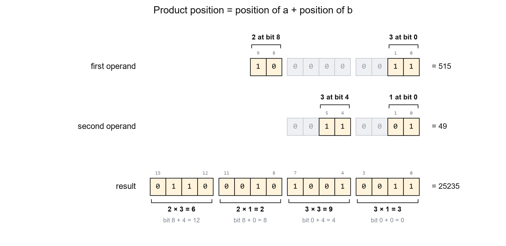

A product's result starts at the sum of its two values’ starting bit positions. As shown in figure above, and It can occupy as many bits as the two values’ widths combined. So the gaps between operands have to be adjusted carefully, so that the outputs dont overwrite each other and remain seperate. 

Using `a0, a1` for A's values and `b0, b1` for B's:

1. We first place a0 and b0 at bit 0, so a0 × b0 starts at bit 0 (0 + 0 = 0) and occupies bits 0–3.
2. We then place b1 at bit 4, so a0 × b1 starts at bit 4 (0 + 4 = 4) and occupies bits 4–7.
3. These two products fill bits 0–7, so we place a1 at bit 8.
4. This puts a1 × b0 at bit 8 (8 + 0 = 8), occupying bits 8–11, and a1 × b1 at bit 12 (8 + 4 = 12), occupying bits 12–15.

### **1.2 Packing Rule** {#sec-1-2}

Place the packed values far enough apart that each product starts after the previous product ends. The zeros between input values create this space. If both inputs contain several values, check every pair, because each value in A multiplies every value in B.

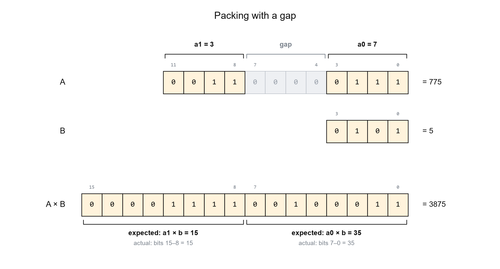

If there are no gaps between the operand or the gaps are not proper, the results wont remain seperate. 

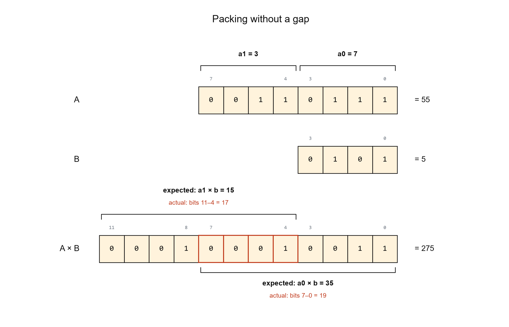

By adding zeroes, we basically creates a space between the results of the multiplication so they can be read as seperatly individual products. 

## **2. Signed Numbers** {#sec-2}

Till now we have discussed unsigned numbers. But applications often requri signed multiplications as well. Packing mulitple signed numbers in same inputs can be a bit tricky.

For a signed number, if all teh operands are positive then there isnt much difference than unsigned case as discussed above. However, if any of the opereand packed into the inputs is negative, then we have a difference scenario. 

### **2.1 Packing the Inputs** {#sec-2-1}

For signed numbers, we use the same spacing rule, but unlike unsigned packing, we cant just concatenate the operands as that can result in dynamically incorrect outputs. 

The most important thing is sign extention. While adding the gaps for unsigned packing, we just added zeroes. However, in case of signed numbers, we have to perform sign extention. So if the first number is negative, the gap will also be sign extended with 1s.

But even after sign extention, we cant concatenate the operands, we cannot just sign extend the gap and concatenate the values, as the output error will then change with the value in the other input.

For example, lets pack `a1 = 3` and `a0 = −1`, with four bits for each value and four bits for the gap.

```text
Just filling the gap with ones:

   a1     gap     a0
  0011   1111    1111  = 1023
```

| B | Expected products | Products extracted from `1023 × B` | Upper-product error |
|---|---|---|---|
| 1 | 3, −1 | 3, −1 | 0 |
| 2 | 6, −2 | 7, −2 | +1 |
| 3 | 9, −3 | 11, −3 | +2 |

Here, the error changes with B input, the error is not fixed/predictable, so adding a correction is also not easier. 

So instead of concatenating, we pack them using signed addition, `A = (a1 <<< 8) + a0`, after sign extending both values to the full input width.

If a0 is negative, this roughly translate to same as concatenation, with the difference that 1 is subtracted from a1. 

Using `a0 = −3` and a 16-bit packed word:

```text
                         upper       lower
a1 shifted by 8:        00000011 | 00000000
Sign-extended a0:      + 11111111 | 11111101
                        --------   --------
16-bit result:          00000010 | 11111101
```

The upper eight bits of sign-extended `a0` are `11111111`, which represents −1 at that eight-bit width. So the upper-field addition is:

```text
3 + (−1) = 2
```

Those upper bits are `11111111` whether `a0` is −1, −2, −3, or another negative value that fits the lower slot. Only the lower bits change with the value of `a0`.

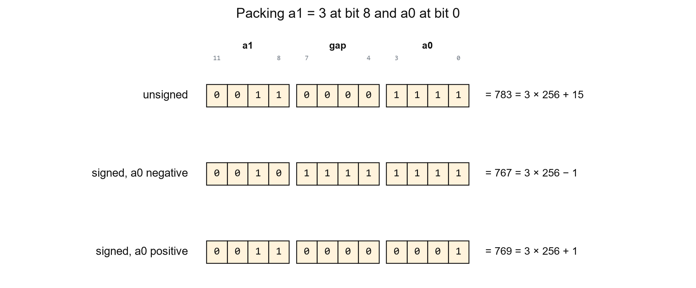

This can be seen in the image above as well. 3 is 11 in binary, but in the negative case, its represented as 10.

For negative first outputs, this will now result in the 2nd output always being 1 less than the correct value. Which is predictable and can be easily corrected. We'll se this in more detial in next section.

### **2.2 Reading the Products** {#sec-2-2}

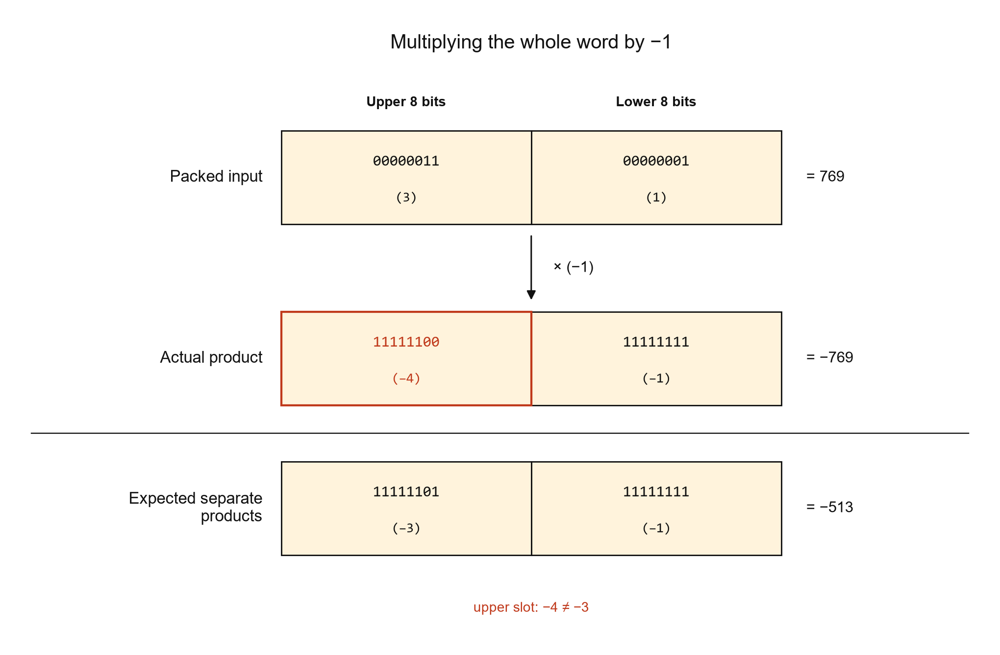

In the figure above, the lower product is correctly read as −1, but the upper product reads −4 instead of −3. So in RTL, we add the MSB of the raw lower slot to the upper slot. This adds 1 when the lower product is negative and 0 otherwise.

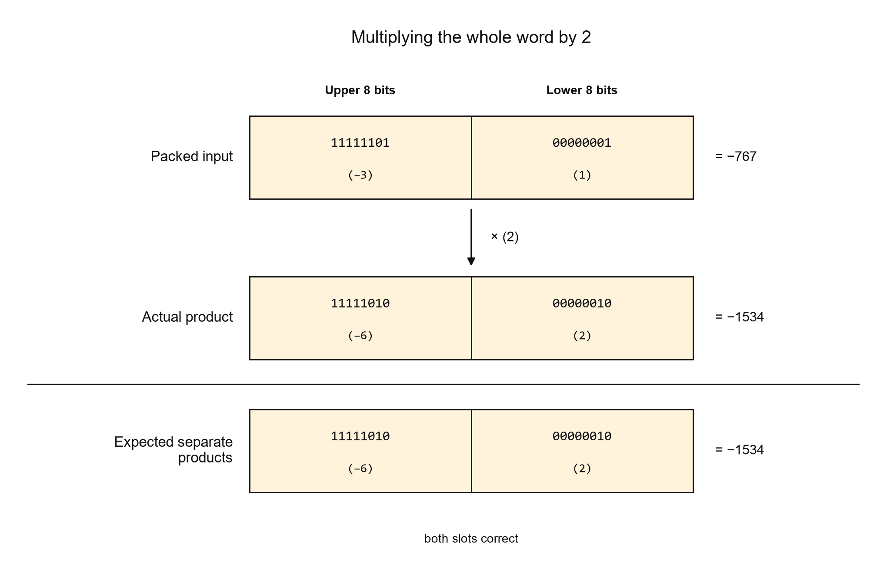

If we assume A and B as our inputs, then we can have floowing cases:

| Values in A | Values in B | Special rules |
|---|---|---|
| Unsigned | Unsigned | Adding gaps as discussed in [unsigned packing rule](#sec-1-2) |
| Unsigned | Signed | Keep the unsigned packing rule for A. If B contains multiple values, use [sign-extended packing](#sec-2-1) for B. Add [correction logic](#sec-2-2) for negative products |
| Signed | Unsigned | Use [sign-extended packing](#sec-2-1) for A. Keep the [unsigned packing rule](#sec-1-2) for B. Add [correction logic](#sec-2-2) for negative products |
| Signed | Signed | Use [sign-extended packing](#sec-2-1) in both inputs. Add [correction logic](#sec-2-2) for negative products |

## **3. Packing on the DSP48E1** {#sec-3}

Now we'll see how to do this in an actual DSP48 block using and RTL example. And show how same logic can be mapped more efficiently using lower resources overall. 

### **3.1 Example** {#sec-3-1}

We'll start with one pair containing two signed 4-bit A values and two signed 4-bit B values. Each A value is multiplied with both B values, giving four products in each pair. We repeat this pair four times, giving 16 multiplications in total.

We pass all the input values to the module on one 64-bit bus. The upper 32 bits contain eight 4-bit A values, and the lower 32 bits contain eight 4-bit B values. Each pair performs the following four multiplications:

- a0xb0
- a0xb1
- a1xb0
- a1xb1

### **3.2 The RTL** {#sec-3-2}

#### **Without Packing**


// 16 signed 4 bit x 4 bit multiplications, each in its own DSP48E1.
// operands[63:32]: A values, operands[31:0]: B values, 4 bits each.

(* use_dsp = "yes" *)
module mult_2x2 (
    input  wire         clk,
    input  wire [63:0]  operands,
    output wire [127:0] products
);
    genvar pair;
    generate
        for (pair = 0; pair < 4; pair = pair + 1) begin : operand_pair
            wire signed [3:0] a0 = operands[32 + 8*pair     +: 4];
            wire signed [3:0] a1 = operands[32 + 8*pair + 4 +: 4];
            wire signed [3:0] b0 = operands[8*pair          +: 4];
            wire signed [3:0] b1 = operands[8*pair + 4      +: 4];

            reg signed [7:0] p00, p01, p10, p11;
            always @(posedge clk) begin
                p00 <= a0 * b0;
                p01 <= a0 * b1;
                p10 <= a1 * b0;
                p11 <= a1 * b1;
            end
            assign products[32*pair +: 32] = {p11, p10, p01, p00};
        end
    endgenerate
endmodule


This is a simple naive implementation, we just use a for loop to implement the 16 multplications, the *use_dsp* pragma is to tell vivado to use the DSP blocks for the arithmatic. And as we can see in the utilization report below, it results in 16 dsps being implemented. 

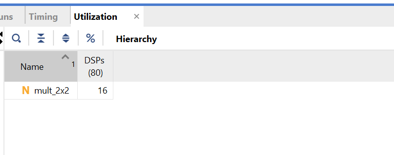

**Without packing: 16 DSPs**

#### **With Packing**

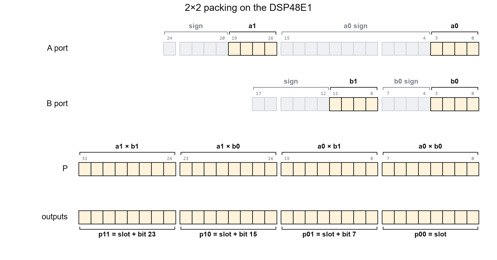

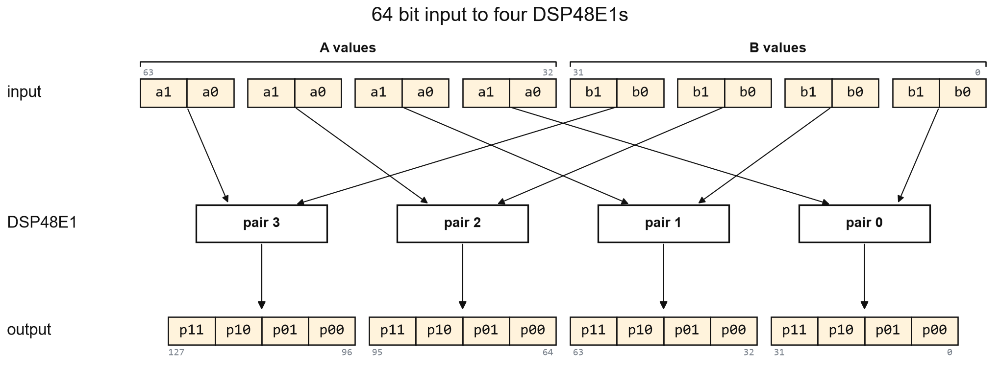


// 16 signed 4 bit x 4 bit multiplications in four DSP48E1s, four per DSP.
// operands[63:32]: A values, operands[31:0]: B values, 4 bits each.

module packed_mult_2x2 (
    input  wire         clk,
    input  wire [63:0]  operands,
    output wire [127:0] products
);
    genvar pair;
    generate
        for (pair = 0; pair < 4; pair = pair + 1) begin : operand_pair
            wire signed [3:0] a0 = operands[32 + 8*pair     +: 4];
            wire signed [3:0] a1 = operands[32 + 8*pair + 4 +: 4];
            wire signed [3:0] b0 = operands[8*pair          +: 4];
            wire signed [3:0] b1 = operands[8*pair + 4      +: 4];

            // Multiplier inputs: A 25 bits, B 18 bits. DSP output: P 48 bits.
            // Pack: a1 at bit 16, a0 at bit 0; b1 at bit 8, b0 at bit 0.
            // A signed addition, not a concatenation, keeps negative values correct.
            wire signed [24:0] a_packed = (a1 <<< 16) + a0;   // A port, added in the DSP pre-adder
            wire signed [17:0] b_packed = (b1 <<< 8)  + b0;   // B port, added in LUTs

            // One multiplication gives all four products, 8 bits apart.
            (* use_dsp = "yes" *) reg signed [47:0] product;    // P register
            always @(posedge clk)
                product <= a_packed * b_packed;

            // Read the 8 bit slots. A negative product borrows 1 from the slot above,
            // so each slot adds back the sign bit of the slot below.
            reg signed [7:0] p00, p01, p10, p11;
            always @(posedge clk) begin
                p00 <= product[7:0];
                p01 <= product[15:8]  + product[7];
                p10 <= product[23:16] + product[15];
                p11 <= product[31:24] + product[23];
            end
            assign products[32*pair +: 32] = {p11, p10, p01, p00};
        end
    endgenerate
endmodule


- lines 20–21: the values are packed with a signed addition, so a negative a0 or b0 is subtracted from the value above it instead of being read as a positive number.
- line 26: one multiplication per pair gives all four products.
- lines 33–35: each slot adds the sign bit of the slot below it (bit 7, 15, 23), which gives back the 1 a negative lower product borrows from it.

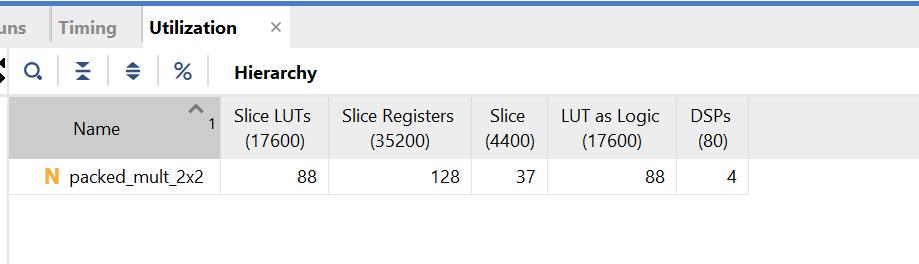

**With packing: 4 DSPs, 88 LUTs, 128 registers**

The LUTs come from the B packing addition, which the DSP48E1 can't do internally, and the three slot corrections; the registers are the 32 output bits of each pair.

The version without packing has one clock cycle of latency, while the packed version has two. The extra cycle comes from registering the corrected products after registering the packed multiplication result. Both versions can still accept new inputs every clock and produce 16 products every clock once the pipeline is full.

### **3.3 Simulation** {#sec-3-3}

The testbench gives each case to all four pairs and compares every product with a separate multiplication. Then it runs every input combination of one pair, 65,536 of them, with random values on the other three pairs:

All 1,048,576 products match the separate multiplications.

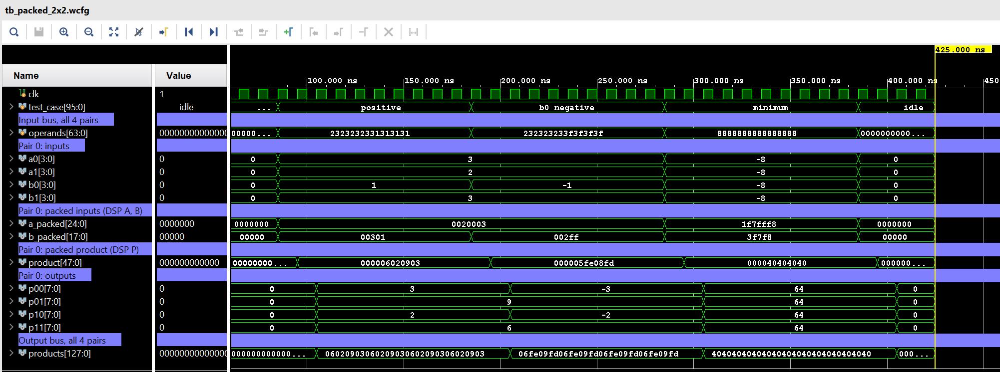

**The waveform shows three test cases for pair 0, along with the complete `operands` and `products` buses. The packed product appears one clock after the inputs, and the corrected outputs one clock after that.**

## **4. Summary** {#sec-4}

- We can get better resource utilization if we pack more operands into same inputs.
- For unsigned operands, the position of operands needs to be decided by adding appropriate gaps with 0s so that the results dont overlap.
- For signed operands, the gaps must be sign extented, and instead of concatenation, the operands should be shifted and added.
- A negative product makes the next result 1 less than correct value. Adding the sign bit of the slot below corrects it.
- In the 2×2 signed example, 16 multiplications of 4 × 4 bits take 16 DSPs without packing and 4 DSPs with packing.

<!-- post-nav -->
<div class="post-nav">
  <a class="nav-home" href="https://rafae1130.github.io/">Home</a>
</div>
<!-- /post-nav -->
